> **✅ COMPLETE (verified 2026-07-06 docs audit).** All 15 tasks shipped via PR #87 ("Phase 3: /implement-plan --auto mode", merged as `765b2c7`; tracked as Claudfather/clauDNA#84 — see `CHANGELOG.md:110-115`). `skills/implement-plan/SKILL.md` (933 lines) contains every deliverable this plan specifies: `--auto`/`--autonomous` argument, the canonical "Autonomous Mode" reference section, Step 1.5 sparse-issue refusal, Step 2.5 scope tripwire, Step 3-AUTO synthesis pass, Step 5/6.5 blocked/partial outcomes, Step 7 PR footer, Step 8 skip, Step 9 structured result, disallowed picker/queue paths, and a flowchart with all new `--auto` nodes wired in — grep-verified against every check this plan's own Verification section specifies. Two minor deviations from the original spec, both refinements rather than gaps: Step 2.5's tripwire condition changed from fixed numeric thresholds ("≥2x files") to qualitative judgment (`SKILL.md:484`); and `AskUserQuestion`/emoji references were generalized or dropped in the main skill body (though the shared `_shared/subagent-prompts/*.md` files still say `AskUserQuestion` verbatim — stale by comparison, see Phase 2's Task 3 note). One task (Task 14, smoke test) has no on-record evidence in this repo — see its note below. Otherwise this plan holds up cleanly against the shipped code.

# Phase 3 Implementation Plan — /implement-plan `--auto` mode

> **For agentic workers:** REQUIRED SUB-SKILL: Use superpowers:subagent-driven-development (recommended) or superpowers:executing-plans to implement this plan task-by-task. Steps use checkbox (`- [ ]`) syntax for tracking.

**Goal:** Add `--auto` mode to `/claudna:implement-plan` so it runs end-to-end without user input. The mode adds two new step guards (sparse-issue refusal, scope-expansion tripwire), replaces interactive Step 3 with a machine synthesis pass via `/claudna:weigh-development-paths --auto`, modifies several existing steps to emit `outcome` codes instead of stopping for user discussion, skips the merge gate entirely, and emits the §10.C structured result as the final output.

**Architecture:** All changes live in `skills/implement-plan/SKILL.md`. The mode is gated by an `--auto` argument. Every existing interactive behavior is preserved exactly as-is when `--auto` is NOT set; new conditional branches and new steps appear only in the `--auto` path. The flowchart at the top of the skill body grows to show the new branches.

**Tech Stack:** Markdown only.

**Repo:** clauDNA (`/path/to/clauDNA`)

**Prerequisites:**
- Phase 1 merged: `/claudna:weigh-development-paths --auto` exists; structured-result shape is documented; `/claudna:adversarial-review --dispatch` is non-interactive.
- Phase 2 merged: planning skills produce `## Adversarial Review Findings` sections; Step 3 is split into 3A/3B; Step 6.5 simplification pass exists.
- Read `documentation/specs/2026-05-17-autonomous-mode-and-orchestration-design.md` §5.5, §5.5.1, §5.5.2 in full.

---

## File Structure

| File | Action | Notes |
|---|---|---|
| `skills/implement-plan/SKILL.md` | Modify | All Phase 3 changes |
| `skills/implement-plan/engineering-principles.md` | Read-only | Referenced by existing steps; no change |
| `skills/implement-plan/red-flags-and-rationalizations.md` | Read-only | Referenced by existing steps; no change |
| `CHANGELOG.md` | Modify | Phase 3 entry |

---

## Mode contract recap (from design §5.5)

| Step | Interactive (existing) | `--auto` (new) |
|---|---|---|
| 1: Receive plan | Path/issue picker | Requires explicit work item; no picker |
| 1.5: Plan-detail check (NEW) | Offers to expand findings-only issues | Refuses sparse issues: `outcome: blocked` |
| 2: Codebase comparison | Same | Same |
| 2.5: Scope-expansion tripwire (NEW) | Not run | Exits `outcome: bypassed` if Step 2 reveals scope significantly larger than the plan |
| 3: Challenge round | 3A + 3B (Phase 2) | Replaced by synthesis pass invoking `/weigh-development-paths --auto` |
| 4: Mark in-progress | Same | Same |
| 5: Branch + implement | "Feels wrong → stop & discuss" | "Feels wrong" → `outcome: blocked` exit |
| 6: Verify | Fix-and-retry | Same; persistent failure → `outcome: partial` |
| 6.5: Simplify | Ask user on regression | Auto-revert on regression |
| 7: PR | Open PR | Open PR |
| 8: Merge gate | Offer merge/stop | Skipped entirely |
| 9: Summary | Human-readable | Structured result per §10.C |

---

## Task 1: Read source files

**✅ COMPLETE** — prep step; confirmed by all downstream tasks (2-15) having shipped.

- [ ] **Step 1: Read the design spec**

Specifically §5.5 (overall --auto table), §5.5.1 (interactive Step 3A — already implemented in Phase 2, but understand what it produces), §5.5.2 (the synthesis pass).

- [ ] **Step 2: Read the current `/implement-plan` SKILL.md end-to-end**

Pay close attention to:
- The frontmatter (`allowed-tools`)
- The DOT flowchart (will need updates)
- Step 1 (path parsing, queue formation) — Phase 3 disallows queues in `--auto`
- Step 2 (codebase comparison) — Step 2.5 reads its output
- Step 3 (Phase 2 just made this 3A/3B) — `--auto` replaces both with synthesis
- Step 5 (branch + implement) — "feels wrong" behavior changes
- Step 6 (verify) — failure behavior changes
- Step 6.5 (Phase 2 added this) — regression behavior changes
- Step 7 (PR) — message tone changes (no merge prompt)
- Step 8 (merge gate) — skipped entirely
- Step 9 (summary) — emits structured result

- [ ] **Step 3: Read `/weigh-development-paths --auto` contract (Phase 1)**

In `skills/weigh-development-paths/SKILL.md`, find the "Autonomous Mode (`--auto`)" section. Note exactly what input bundle it expects and what it emits. Phase 3 Task 6 constructs the bundle from `/implement-plan`'s context.

- [ ] **Step 4: Read the orchestration guide §10.B and §10.C**

In `skills/_shared/orchestration-guide.md`, re-read "For implementation skills (Tier 3)" (Phase 1 added it) and "Structured Result Shape" (§10.C). Phase 3 emits per §10.C and follows the §10.B contract.

No commit for Task 1.

---

## Task 2: Update frontmatter argument-hint and add `--auto` to Arguments section

**✅ COMPLETE** — `skills/implement-plan/SKILL.md:5` (`argument-hint: "[--source github [number]] [--auto] [file-path-or-directory]"`) and the Arguments section (`SKILL.md:54`) both match this task's text almost verbatim.

**Files:**
- Modify: `skills/implement-plan/SKILL.md`

- [ ] **Step 1: Update the frontmatter `argument-hint`**

Open `skills/implement-plan/SKILL.md`. The existing frontmatter has:

```yaml
argument-hint: "[--source github [number]] [file-path-or-directory]"
```

Use Edit. `old_string`:

```
argument-hint: "[--source github [number]] [file-path-or-directory]"
```

`new_string`:

```
argument-hint: "[--source github [number]] [--auto] [file-path-or-directory]"
```

- [ ] **Step 2: Add `--auto` to the Arguments section**

Find the existing Arguments section:

```
## Arguments

Parse the invocation arguments:
- `--source github <number>`: Read a specific GitHub Issue as the implementation plan.
- `--source github` (no number): Browse all open issues via paginated picker — select one or more to implement.
- Remaining text (or no flag): treated as a file path or session directory.
- No arguments at all: scan for plan directories and present a picker.
- See source guide (`skills/_shared/source-guide.md`) for details on both GitHub modes.
```

Use Edit. `old_string`:

```
- See source guide (`skills/_shared/source-guide.md`) for details on both GitHub modes.
```

`new_string`:

````
- See source guide (`skills/_shared/source-guide.md`) for details on both GitHub modes.
- `--auto` (alias: `--autonomous`): Fully non-interactive mode. Replaces user input with sensible defaults and machine synthesis. Requires an explicit work item (`--source github <number>` OR a single file path) — picker modes and queue mode are disallowed. Never merges. Emits the structured-result shape from `skills/_shared/orchestration-guide.md` §10.C as the final output. See the "Autonomous Mode (`--auto`)" section below for the full behavior contract.
````

- [ ] **Step 3: Verify and commit**

```bash
grep -n "auto.*Fully non-interactive" /path/to/clauDNA/skills/implement-plan/SKILL.md
python3 /path/to/clauDNA/scripts/validate-skills.py
```

```bash
cd /path/to/clauDNA
git add skills/implement-plan/SKILL.md
git commit -m "feat(implement-plan): add --auto argument to frontmatter and Arguments section"
```

---

## Task 3: Add a top-level "Autonomous Mode (`--auto`)" section to the skill body

**✅ COMPLETE** — `skills/implement-plan/SKILL.md:56-136` `## Autonomous Mode (`--auto`)` section present with required invocation shape, step-by-step table, synthesis-pass summary, output shape, and forbidden-operations list — matches this task's text closely. One indirection added since: the synthesis-pass description at `SKILL.md:93` now points to the canonical `skills/_shared/contracts/synthesis-contract.md` rather than inlining the schema a second time (that file was created by this same phase's Task 6, then relocated into `contracts/` by a later PR #132).

**Files:**
- Modify: `skills/implement-plan/SKILL.md`

This task adds the canonical reference section for `--auto` behavior. Individual step edits in later tasks reference back to this section.

- [ ] **Step 1: Insert the section near the top, after the Arguments section but before "Engineering Philosophy"**

Find the heading:

```
## Engineering Philosophy
```

Use Edit. `old_string`:

```
## Engineering Philosophy
```

`new_string`:

````
## Autonomous Mode (`--auto`)

When `$ARGUMENTS` contains `--auto` (or its alias `--autonomous`), the skill runs end-to-end without user input. This section is the canonical reference for `--auto` behavior. Individual procedure steps below reference back here.

### Required invocation shape

- `/claudna:implement-plan --source github <number> --auto`
- `/claudna:implement-plan <path-to-plan-file> --auto`

NOT supported in `--auto`:
- `--source github` without a number (the browse picker)
- Directory paths (the level-2 plan picker)
- Empty arguments (the directory scanner)

If invoked with `--auto` and any ambiguous source, exit immediately with the structured result `outcome: "blocked"`, `blocker_description: "ambiguous source in --auto; specify a single issue number or plan file path"`.

### Step-by-step behavior in `--auto`

| Step | What changes |
|---|---|
| 1: Receive plan | Picker/browse modes disabled. Single work item only. |
| 1.5: Plan-detail check (NEW) | Refuses sparse issues. Exits with `outcome: "blocked"` if the plan body lacks an `## Implementation Plan` section. |
| 2: Codebase Comparison | No change |
| 2.5: Scope-expansion tripwire (NEW) | If Step 2 reveals the scope is significantly larger than the plan describes, exits with `outcome: "bypassed"` |
| 3: Challenge Round | Replaced by §5.5.2 synthesis pass (see "Synthesis pass" below) |
| 4: Mark In Progress | No change |
| 5: Branch & Implement | "Feels wrong" exits with `outcome: "blocked"` instead of stopping for user discussion |
| 6: Verify | Persistent verification failure (after fix-and-retry attempts) exits with `outcome: "partial"` |
| 6.5: Simplify | On regression, automatically reverts the simplify commit (no user prompt) and proceeds with a note in the PR body |
| 7: PR | Opens PR. Suppresses any post-PR user messages. |
| 8: Merge Gate | Skipped entirely. Never offers merge. |
| 9: Summary | Emits the structured-result JSON block (§10.C) as the FINAL output of the run |

### Synthesis pass (replaces Step 3 in `--auto`)

Per design §5.5.2, when Step 2 (Codebase Comparison) completes in `--auto`:

1. **Extract open adversarial findings** from the plan body. Look for `## Adversarial Review Findings` and collect any items where the checkbox is unchecked (`- [ ]`). Phase 2 of the design ensures planning skills emit these.

2. **Generate machine-form matrix concerns**. Read `skills/implement-plan/challenge-round-questions.md`. For each matrix category relevant to this plan (architecture, testing, dependencies, error-handling, etc.), produce 1-3 concrete decision points drawn from the Step 2 codebase comparison. Each decision point is `{category, question, options[]}`.

3. **Package the context bundle.** Write a temporary markdown file at `/tmp/implement-plan-<timestamp>/synthesis-bundle.md` with this structure:

```markdown
## Plan
<original plan body, including the Adversarial Review Findings section>

## Open Adversarial Findings
- [<concern_area>][<severity>] <summary> — <recommendation>
- ...

## Open Matrix Decisions
- [<category>] <question> — Options: A) ..., B) ..., C) ...
- ...

## Codebase Comparison Artifacts
<the Plan vs Codebase table and any stale reference notes from Step 2>
```

4. **Invoke `/claudna:weigh-development-paths --auto`** as a `general-purpose` subagent. Prompt:

```
Read the skill body at skills/weigh-development-paths/SKILL.md.

Apply the skill with --auto mode against the context bundle at:
  /tmp/implement-plan-<timestamp>/synthesis-bundle.md

Return ONLY the structured-result JSON block per the skill's emission contract.
Do NOT enter Plan Mode. Do NOT invoke AskUserQuestion.
```

5. **Parse the subagent's structured result.**
   - If `outcome: "completed"`: read `artifacts.refined_plan` (the synthesized refined plan content). Write it back to the plan body (or post as a comment on the GitHub issue with a clear `[implement-plan-auto] Refined plan via synthesis pass` header). The refined plan supersedes the original for Steps 4 onward.
   - If `outcome: "blocked"`: the synthesizer found unresolvable decisions. Exit `/implement-plan --auto` with `outcome: "needs-input"`, populate `blocker_description` with the unresolvable decisions list from the subagent's blocker_description.
   - If `outcome` is anything else: treat as a synthesis failure. Exit with `outcome: "blocked"`, `blocker_description: "synthesis pass returned outcome: <X>"`.

6. **Mark all open adversarial findings as RESOLVED** in the plan body (change `- [ ]` to `- [x]` for each, append a sub-bullet with the synthesis rationale for that finding).

### Output (structured result)

After Step 9, emit a single fenced JSON block as the FINAL output:

```json
{
  "skill": "implement-plan",
  "outcome": "completed",
  "artifacts": {
    "pr_url": "https://github.com/org/repo/pull/456",
    "branch": "implement/some-slug",
    "issue_url": "https://github.com/org/repo/issues/123",
    "files_changed": 3,
    "lines_added": 47,
    "lines_removed": 12,
    "synthesis_decisions_resolved": 4,
    "simplify_applied": true,
    "simplify_reverted": false
  },
  "summary": "<2-4 line digest of what shipped>",
  "next": "<orchestrator hint, e.g. 'Schedule reviewer bot to look at PR #456' or null>",
  "errors": [],
  "blocker_description": null
}
```

`outcome` mapping for `--auto`:
- `completed` — PR opened with all verification passing
- `bypassed` — Step 2.5 scope-expansion tripwire fired
- `blocked` — Step 1.5 sparse issue, Step 5 "feels wrong", synthesis pass blocked
- `needs-input` — synthesis pass returned unresolvable decisions
- `partial` — verification ultimately failed after multiple fix attempts; PR opened with failing checks noted in body

When `outcome != "completed"`, populate `blocker_description` with 1-2 sentences explaining what blocked the work and what would unblock it.

### Forbidden in `--auto`

- `AskUserQuestion` calls. There is no human at the keyboard.
- `EnterPlanMode` / `ExitPlanMode` is allowed when delegating to subagents that need it; the orchestrator itself does NOT enter Plan Mode.
- Offering merge. Step 8 is skipped, period.
- Writing to the user-managed `~/.claude/notes/` or `~/.claude/settings.json` (this rule applies in all modes, but is critical in unattended runs).

## Engineering Philosophy
````

- [ ] **Step 2: Verify and commit**

```bash
grep -n "## Autonomous Mode" /path/to/clauDNA/skills/implement-plan/SKILL.md
grep -n "Synthesis pass" /path/to/clauDNA/skills/implement-plan/SKILL.md
python3 /path/to/clauDNA/scripts/validate-skills.py
```

Expected: matches found, validator passes.

```bash
cd /path/to/clauDNA
git add skills/implement-plan/SKILL.md
git commit -m "$(cat <<'EOF'
docs(implement-plan): add canonical Autonomous Mode reference section

New section near the top of the skill body documents the full --auto
contract: required invocation shape, per-step behavior changes,
synthesis pass (replaces Step 3), structured-result output, forbidden
operations. Subsequent procedure steps reference this section for their
--auto branches.

Part of the autonomous-mode-and-orchestration design (2026-05-17 spec).
EOF
)"
```

---

## Task 4: Add Step 1.5 (Plan-detail check / sparse-issue refusal)

**✅ COMPLETE** — `skills/implement-plan/SKILL.md:433-461` `### Step 1.5: Plan-Detail Check` present, matching this task's spec (including the exact `outcome: blocked` JSON example) almost verbatim.

**Files:**
- Modify: `skills/implement-plan/SKILL.md`

- [ ] **Step 1: Insert Step 1.5 between Step 1 and Step 2**

Find the heading sequence:

```
### Step 2: Codebase Comparison
```

The preceding section is Step 1 (its prose ends with the queue formation). Use Edit. `old_string`:

```
### Step 2: Codebase Comparison
```

`new_string`:

````
### Step 1.5: Plan-Detail Check

After the work item is loaded into the queue (Step 1), validate that the plan body has enough detail to implement.

**A plan is "implementable" if its body contains an `## Implementation Plan` section** with a `### Steps` (or equivalent step-by-step prose) sub-section. This convention is set by the output-guide (`skills/_shared/output-guide.md` §4.1) — every planning skill writing to GitHub Issues produces this section. Plans on disk (`documentation/planning/`) follow the phase-doc structure (orchestration guide §5) which always includes a "Detailed Implementation Plan" section.

**If the plan IS implementable:** proceed to Step 2.

**If the plan is NOT implementable (findings-only or otherwise sparse):**

- **Interactive mode:** Offer to expand. Use AskUserQuestion: "This plan lacks an implementation section. Options: expand via Explore subagents (will edit the plan in place / comment on the issue), or abort." If user picks "expand," delegate to subagent(s) to flesh out the implementation steps based on the findings, then proceed to Step 2 once expansion is committed.

- **`--auto` mode:** Refuse. Exit immediately with the structured-result block:

```json
{
  "skill": "implement-plan",
  "outcome": "blocked",
  "artifacts": {
    "issue_url": "<source URL or path>"
  },
  "summary": "Plan lacks ## Implementation Plan section; cannot implement in --auto mode.",
  "next": "Run /claudna:tech-debt --auto, /claudna:security-audit --auto, or similar planning skill against this issue to expand it into an implementable plan, then re-invoke /implement-plan --auto.",
  "errors": [],
  "blocker_description": "Source issue body has findings but no implementation plan. Expansion requires planning judgment that --auto mode does not provide. Run a planning skill first."
}
```

Do NOT attempt to write code or branch. Do NOT attempt heuristic expansion in `--auto`. The point of refusing is to keep `--auto` mode narrow: planning skills do planning, implementation skills do implementation.

### Step 2: Codebase Comparison
````

- [ ] **Step 2: Verify and commit**

```bash
grep -n "Step 1.5: Plan-Detail Check" /path/to/clauDNA/skills/implement-plan/SKILL.md
python3 /path/to/clauDNA/scripts/validate-skills.py
```

```bash
cd /path/to/clauDNA
git add skills/implement-plan/SKILL.md
git commit -m "$(cat <<'EOF'
feat(implement-plan): add Step 1.5 plan-detail check

Validates that the plan body has an Implementation Plan section before
proceeding. Interactive mode offers to expand sparse plans; --auto mode
refuses with outcome: blocked.

Part of the autonomous-mode-and-orchestration design (2026-05-17 spec).
EOF
)"
```

---

## Task 5: Add Step 2.5 (Scope-expansion tripwire)

**✅ COMPLETE, condition refined** — `skills/implement-plan/SKILL.md:469-529` `### Step 2.5: Scope-Expansion Tripwire` present. The tripwire's trigger condition was loosened from this task's fixed numeric thresholds (≥2x files, 10+ callers, 20+ file cascade) to explicit qualitative judgment: "There are no fixed numeric thresholds; trust the comparison output" (`SKILL.md:484`). Everything else (JSON exit shape, issue comment, `needs-input` label) matches.

**Files:**
- Modify: `skills/implement-plan/SKILL.md`

- [ ] **Step 1: Insert Step 2.5 between Step 2 and Step 3**

Find this text (the current end of Step 2 and start of Step 3):

```
### Step 3: Challenge Round
```

Use Edit. `old_string`:

```
### Step 3: Challenge Round
```

`new_string`:

````
### Step 2.5: Scope-Expansion Tripwire (`--auto` only)

This step is `--auto` only. Interactive mode skips it — interactive users can ratify scope changes through the challenge round and continue.

After Step 2's codebase comparison produces a "Plan vs. Codebase" table, compare the scope the plan ANTICIPATES against the scope Step 2 REVEALS:

**Plan-anticipated scope:**
- Files listed explicitly in the plan body (e.g., "Files to modify: A.py, B.py" or "Create: new/path.py")
- Files implied by referenced functions/classes (`UserService.authenticate` → `services/user.py`)

**Step-2-revealed scope:**
- All files Step 2 identified as relevant (including dependency-graph callers, related test files, configuration files that import the touched modules)

**Tripwire condition (any one is sufficient):**
1. Step 2 reveals ≥2× the file count the plan anticipated (e.g., plan says "3 files," Step 2 finds 6+).
2. Step 2 surfaces a caller surface the plan did not mention (e.g., the named function has 10+ callers across modules, none referenced in the plan).
3. Step 2 reveals a structural concern the plan didn't address (e.g., changing a type definition that touches 20+ files via TypeScript inference).

**Action:**

Exit with the structured-result block:

```json
{
  "skill": "implement-plan",
  "outcome": "bypassed",
  "artifacts": {
    "issue_url": "<source URL or path>",
    "anticipated_files": ["..."],
    "revealed_files": ["..."],
    "files_anticipated": 3,
    "files_revealed": 12
  },
  "summary": "Scope expansion detected: plan anticipated N files but codebase comparison reveals M files. Bypassed to avoid risky headless refactor.",
  "next": "Surface to a human for scope-bounded refactor or split into smaller phase docs.",
  "errors": [],
  "blocker_description": "The plan's stated scope is smaller than the actual codebase impact. Headless implementation would likely produce surprises. Re-plan with the full surface, or split into multiple smaller PRs."
}
```

After emitting the block, also post a comment on the source issue (if GitHub) explaining why the work was bypassed. Comment body:

```markdown
## /implement-plan --auto bypassed: scope expansion detected

The plan anticipates touching N files, but a codebase comparison reveals M files are actually affected:

**Anticipated:** A.py, B.py, C.py
**Actually affected:** [full list]

Headless implementation of this scope risks producing surprises (missed call-sites, type-inference cascades, etc.). Bypassing.

**Suggested next steps:**
- Re-plan with the full surface listed
- Or split into multiple smaller phase docs covering subsets

This was an automatic decision by `/claudna:implement-plan --auto`.
```

Add a `needs-input` label to the issue via `gh issue edit <number> --add-label "needs-input"` (create the label first via `gh label create` if it doesn't exist — skip silently if label creation fails for permission reasons).

**Tripwire is a safety net, not a primary filter.** The claudlobby `autonomous-runner` wrapper does qualitative pre-flight risk classification (mechanical / localized / structural per Phase 4 §6.1.1). The tripwire here catches surprises where the pre-flight classifier was wrong because the issue text understated the change.

### Step 3: Challenge Round
````

- [ ] **Step 2: Verify and commit**

```bash
grep -n "Step 2.5: Scope-Expansion Tripwire" /path/to/clauDNA/skills/implement-plan/SKILL.md
python3 /path/to/clauDNA/scripts/validate-skills.py
```

```bash
cd /path/to/clauDNA
git add skills/implement-plan/SKILL.md
git commit -m "$(cat <<'EOF'
feat(implement-plan): add Step 2.5 scope-expansion tripwire

When --auto Step 2 reveals scope significantly larger than the plan
anticipates (>=2x files, missing callers, structural cascade),
exit outcome: bypassed and post a comment on the source issue
explaining why. Safety net for cases where claudlobby's pre-flight
risk classifier missed the surprise.

Interactive mode skips this step entirely.

Part of the autonomous-mode-and-orchestration design (2026-05-17 spec).
EOF
)"
```

---

## Task 6: Implement the `--auto` Step 3 synthesis pass

**✅ COMPLETE** — `skills/implement-plan/SKILL.md:539-641` `#### Step 3-AUTO: Synthesis pass` present with all 6 steps (scratch dir, extract findings, generate matrix decisions, write bundle, dispatch subagent, parse completed/blocked/other) matching this task almost verbatim. Now cites `skills/_shared/contracts/synthesis-contract.md` (`SKILL.md:541,593`) as the canonical schema instead of restating it inline.

**Files:**
- Modify: `skills/implement-plan/SKILL.md`

This task adds the `--auto` branch to Step 3 (which is currently 3A/3B from Phase 2). The synthesis pass replaces both 3A and 3B when `--auto` is set.

- [ ] **Step 1: Add a top-level `--auto` branch at the start of Step 3**

Find the heading (Phase 2 added the 3A/3B split):

```
### Step 3: Challenge Round
```

The current section opens with "Step 3 has two sub-steps: 3A seeds..." prose. Use Edit. `old_string`:

```
### Step 3: Challenge Round

Read `challenge-round-questions.md` for the question matrix and `red-flags-and-rationalizations.md` to guard against rubber-stamping.

Step 3 has two sub-steps: **3A** seeds the round with any open adversarial-review findings from the plan body; **3B** runs the matrix-driven flow. 3A is skipped when no adversarial findings are present (ad-hoc plans, or plans where every finding was already resolved).
```

`new_string`:

````
### Step 3: Challenge Round

Read `challenge-round-questions.md` for the question matrix and `red-flags-and-rationalizations.md` to guard against rubber-stamping.

**Mode branch:**
- **Interactive mode:** runs sub-steps 3A and 3B below.
- **`--auto` mode:** runs sub-step 3-AUTO below, replacing both 3A and 3B with a machine synthesis pass.

#### Step 3-AUTO: Synthesis pass (`--auto` only)

Per design §5.5.2 and the canonical Autonomous Mode reference earlier in this skill, replace the interactive challenge round with a machine synthesis pass.

1. **Create scratch directory.** Use the Write tool to create a file at `/tmp/implement-plan-<YYYY-MM-DD_HHMMSS>/synthesis-bundle.md`. The Write tool creates parent directories automatically.

2. **Extract OPEN adversarial findings.** Read the plan body. Search for `## Adversarial Review Findings`. Collect each finding where the checkbox is `- [ ]` (unchecked). Each finding has `severity`, `concern_area`, `summary`, `recommendation`.

3. **Generate machine-form matrix decision points.** For each matrix category in `challenge-round-questions.md` relevant to this plan:
   - Architecture: where does new code live? Reuse existing pattern or new one?
   - Testing: what tests cover the change? Existing patterns?
   - Dependencies: does the plan introduce new packages?
   - Error handling: what failure modes are explicitly handled?
   - (etc. — match the matrix in the file)
   For each, produce one or more `{category, question, options[]}` triples by drawing options from the Step 2 codebase comparison output.

4. **Write the bundle.** Compose the synthesis bundle at the scratch path:

```markdown
## Plan
<full original plan body>

## Open Adversarial Findings
- [<severity>][<concern_area>] <summary>
  Recommendation: <recommendation>
- ...

## Open Matrix Decisions
- [<category>] <question>
  Options:
  A) <option-A>
  B) <option-B>
  C) <option-C> (if applicable)
- ...

## Codebase Comparison Artifacts
<the Plan vs Codebase table from Step 2 — copy verbatim>
<list of relevant files Step 2 identified beyond what the plan named>
```

5. **Dispatch the synthesis subagent.** Launch a `general-purpose` subagent with this prompt:

```
Read the skill body at skills/weigh-development-paths/SKILL.md.

Apply the skill with --auto mode against the context bundle at:
  /tmp/implement-plan-<timestamp>/synthesis-bundle.md

Return ONLY the structured-result JSON block per the skill's emission contract.
Do NOT enter Plan Mode. Do NOT invoke AskUserQuestion.
Do NOT write to any plan file — the orchestrator handles that.
```

6. **Parse the subagent's structured result.**

   Use the Read tool to read the subagent's final output (it should be a single fenced JSON block). Parse it.

   **If `outcome: "completed"`:**
   - Read `artifacts.refined_plan` (full markdown body) and `artifacts.synthesis_rationales` (per-decision array).
   - Use the Edit tool to update the plan body:
     - Replace the existing plan content with `refined_plan`.
     - For each previously-OPEN adversarial finding, change `- [ ]` to `- [x]` and append a sub-bullet:
       ```
       - [x] **[<severity>] <concern_area>**: <summary>
         - **Recommendation:** <recommendation>
         - **--auto synthesis decision:** <chosen_option> (rationale: <dimensions>)
       ```
   - For GitHub-source issues, post the refined plan as a comment on the issue with the header `## [implement-plan-auto] Refined plan via synthesis pass`.
   - Proceed to Step 4.

   **If `outcome: "blocked"`:** the synthesizer found unresolvable decisions. Exit `/implement-plan --auto` with:

   ```json
   {
     "skill": "implement-plan",
     "outcome": "needs-input",
     "artifacts": {
       "issue_url": "<source URL or path>",
       "unresolvable_decisions": [...]
     },
     "summary": "Synthesis pass returned unresolvable decisions; human input needed.",
     "next": "Surface decisions to a human; once resolved, re-invoke /implement-plan --auto.",
     "errors": [],
     "blocker_description": "<copy from subagent's blocker_description>"
   }
   ```

   Post a comment on the source issue (if GitHub) with the unresolvable decisions formatted as a checklist for a human to fill in.

   **If `outcome` is anything else (timeout, error, malformed JSON):** Exit with:

   ```json
   {
     "skill": "implement-plan",
     "outcome": "blocked",
     "artifacts": {"issue_url": "..."},
     "summary": "Synthesis pass failed: <reason>",
     "next": null,
     "errors": ["synthesis pass returned outcome: <X>"],
     "blocker_description": "Synthesis pass did not return a usable result. Re-invoke with a more complete plan or escalate."
   }
   ```

#### Step 3A: Seed with open adversarial-review findings (interactive only)
````

(The rest of the existing 3A and 3B content stays unchanged — the edit only ADDS the mode branch and the new 3-AUTO sub-section ABOVE the existing 3A.)

- [ ] **Step 2: Update the closing reference at the end of Step 3B**

Phase 2's Step 3B closes with a note: "Note for `--auto` mode: In `--auto` mode (added by Phase 3), Step 3 is replaced entirely by a synthesis pass (see §5.5.2 of the design spec). 3A and 3B above describe interactive behavior only."

This note is now outdated — the mode branch is at the top of Step 3 and the synthesis pass is documented inline. Use Edit. `old_string`:

```
#### Note for `--auto` mode

In `--auto` mode (added by Phase 3), Step 3 is replaced entirely by a synthesis pass (see §5.5.2 of the design spec). 3A and 3B above describe interactive behavior only.
```

`new_string`:

```
#### Note for `--auto` mode

In `--auto` mode, Step 3 is replaced by the Step 3-AUTO synthesis pass above. 3A and 3B describe interactive behavior only.
```

- [ ] **Step 3: Verify and commit**

```bash
grep -n "Step 3-AUTO" /path/to/clauDNA/skills/implement-plan/SKILL.md
grep -n "Synthesis pass" /path/to/clauDNA/skills/implement-plan/SKILL.md
python3 /path/to/clauDNA/scripts/validate-skills.py
```

```bash
cd /path/to/clauDNA
git add skills/implement-plan/SKILL.md
git commit -m "$(cat <<'EOF'
feat(implement-plan): add --auto Step 3 synthesis pass

Replaces interactive 3A/3B with a machine synthesis pass:
1. Extract open adversarial findings from plan body
2. Generate machine-form matrix decision points
3. Package context bundle to /tmp scratch dir
4. Dispatch /claudna:weigh-development-paths --auto subagent
5. Parse structured result; update plan body with refined plan
6. Mark findings RESOLVED with synthesis rationale

Synthesizer's blocked outcome → outcome: needs-input
Synthesizer's error/timeout → outcome: blocked

Part of the autonomous-mode-and-orchestration design (2026-05-17 spec).
EOF
)"
```

---

## Task 7: Modify Step 5 for `--auto` ("feels wrong" → blocked outcome)

**✅ COMPLETE** — `skills/implement-plan/SKILL.md:711-750` "Mode branch for 'feels wrong'" present, matches this task's spec including the JSON `outcome: blocked` shape and the "push the branch" instruction.

**Files:**
- Modify: `skills/implement-plan/SKILL.md`

- [ ] **Step 1: Add a mode branch to Step 5's "feels wrong" behavior**

Find this text in `skills/implement-plan/SKILL.md` Step 5 ("Branch & Implement"):

```
Create branch `implement/<slug>`. Implement incrementally — commit per logical chunk with messages referencing plan steps. If a step feels wrong, **stop and discuss**.
```

Use Edit. `old_string`:

```
Create branch `implement/<slug>`. Implement incrementally — commit per logical chunk with messages referencing plan steps. If a step feels wrong, **stop and discuss**.
```

`new_string`:

````
Create branch `implement/<slug>`. Implement incrementally — commit per logical chunk with messages referencing plan steps.

**Mode branch for "feels wrong":**

If a step feels wrong (you encounter a situation the plan didn't anticipate, you find yourself making decisions the plan should have specified, or the code resists the planned approach):

- **Interactive mode:** stop and discuss with the user. Surface the conflict via AskUserQuestion or plain text; wait for direction.

- **`--auto` mode:** stop implementation, capture the conflict, and exit with the structured-result block:

```json
{
  "skill": "implement-plan",
  "outcome": "blocked",
  "artifacts": {
    "issue_url": "<source URL or path>",
    "branch": "implement/<slug>",
    "files_changed": <N>,
    "commits_made": <M>
  },
  "summary": "Implementation blocked at step <X>: <one-line description of conflict>.",
  "next": "Surface to human for scope clarification; once resolved, re-invoke /implement-plan --auto or implement interactively.",
  "errors": [],
  "blocker_description": "<2 sentences explaining what felt wrong and what would unblock it>"
}
```

Do NOT continue implementing through ambiguity in `--auto`. Do NOT improvise design decisions the plan should have specified. The branch is left as-is (partial commits may exist); a human can pick it up.

Push the branch even though no PR will be opened in this exit path:

```bash
git push -u origin implement/<slug>
```

This makes the work visible without prematurely opening a PR with incomplete content.
````

- [ ] **Step 2: Verify and commit**

```bash
grep -n "Mode branch for" /path/to/clauDNA/skills/implement-plan/SKILL.md
python3 /path/to/clauDNA/scripts/validate-skills.py
```

```bash
cd /path/to/clauDNA
git add skills/implement-plan/SKILL.md
git commit -m "feat(implement-plan): in --auto, 'feels wrong' exits outcome: blocked"
```

---

## Task 8: Modify Step 6.5 (Simplify) regression handling for `--auto`

**✅ COMPLETE** — `skills/implement-plan/SKILL.md:807-828` includes the `verification_failed_after_revert` JSON block (line 819) exactly as this task specifies.

**Files:**
- Modify: `skills/implement-plan/SKILL.md`

Phase 2 added Step 6.5 with both interactive and `--auto` regression paths already mentioned. Confirm both paths are documented correctly; tighten the `--auto` revert logic.

- [ ] **Step 1: Locate Step 6.5's regression-handling text**

Phase 2 (Task 11) added this content:

```
- **`--auto` mode:** Revert /simplify's commit unconditionally:

```bash
git reset --hard HEAD~1
```

  Add a note for the eventual PR body (Step 7): "Simplification pass attempted; reverted due to verification regression: `<error summary>`." Proceed to Step 7 with the pre-simplify diff.
```

Confirm this is present. If it isn't (i.e., Phase 2 work was not applied or differs), apply it now per the template above.

- [ ] **Step 2: Add a check on multiple successive regressions**

Use Edit. Find the `--auto` regression block (above). The current behavior reverts once and proceeds. Add a safety check: if Step 6 verification still fails AFTER the revert (which shouldn't happen because we're back to the pre-simplify state, but theoretically could due to environmental flakiness), exit with `outcome: partial`.

After the `Proceed to Step 7 with the pre-simplify diff.` line in the `--auto` block, append:

```
After the revert, re-run Step 6 verification one more time. If verification STILL fails (extremely rare — environmental flakiness or pre-existing breakage that /simplify exposed), exit with the structured-result block:

```json
{
  "skill": "implement-plan",
  "outcome": "partial",
  "artifacts": {
    "issue_url": "<source URL or path>",
    "branch": "implement/<slug>",
    "files_changed": <N>,
    "simplify_applied": true,
    "simplify_reverted": true,
    "verification_failed_after_revert": true
  },
  "summary": "Implementation completed but verification failed after simplify revert. Manual investigation needed.",
  "next": "Investigate verification regression; may be pre-existing or environmental.",
  "errors": ["<verification error output>"],
  "blocker_description": "Verification failed after reverting the simplify pass. The implementation diff alone (without simplify) does not pass verification. This is unexpected and warrants human investigation."
}
```

Do NOT open a PR in this case. Push the branch (`git push -u origin implement/<slug>`) so the work is visible.
```

- [ ] **Step 3: Verify and commit**

```bash
grep -n "verification_failed_after_revert" /path/to/clauDNA/skills/implement-plan/SKILL.md
python3 /path/to/clauDNA/scripts/validate-skills.py
```

```bash
cd /path/to/clauDNA
git add skills/implement-plan/SKILL.md
git commit -m "feat(implement-plan): handle persistent verification failure post-revert in --auto"
```

---

## Task 9: Modify Step 7 (PR) tone for `--auto`

**✅ COMPLETE, cosmetic diff** — `skills/implement-plan/SKILL.md:842-860` "Mode branch" present with the bot-footer text. The 🤖 emoji this task's draft used was dropped in the shipped body (`SKILL.md:851` reads "Opened by `/claudna:implement-plan --auto`." with no emoji) — consistent with this repo's own no-emoji-unless-asked convention; not a functional gap.

**Files:**
- Modify: `skills/implement-plan/SKILL.md`

- [ ] **Step 1: Add a mode branch to Step 7's closing message**

Find this text in Step 7:

```
Tell the user the PR is ready.
```

Use Edit. `old_string`:

```
Tell the user the PR is ready.
```

`new_string`:

````
**Mode branch:**

- **Interactive mode:** Tell the user the PR is ready, and remind them they can choose merge/stop at Step 8.

- **`--auto` mode:** Do NOT tell the user. Capture the PR URL into the structured result's `artifacts.pr_url` for Step 9. Also augment the PR body with a footer:

```markdown
---

🤖 Opened by `/claudna:implement-plan --auto`.

This PR was generated without interactive human review. Before merging:
- Confirm the implementation matches your understanding of the issue
- Run the verification commands listed above locally if you want a second pass
- The simplification pass [was applied / was reverted / was not run — populate based on actual run]
- Synthesis decisions are recorded in the plan body (see issue/source for full plan)
```

Substitute the bracketed text per the actual run.
````

- [ ] **Step 2: Verify and commit**

```bash
grep -n "Opened by \`/claudna:implement-plan --auto\`" /path/to/clauDNA/skills/implement-plan/SKILL.md
python3 /path/to/clauDNA/scripts/validate-skills.py
```

```bash
cd /path/to/clauDNA
git add skills/implement-plan/SKILL.md
git commit -m "feat(implement-plan): in --auto, add bot-opened footer to PR body"
```

---

## Task 10: Skip Step 8 (Merge Gate) entirely in `--auto`

**✅ COMPLETE** — `skills/implement-plan/SKILL.md:864-872` "SKIPPED ENTIRELY" present verbatim.

**Files:**
- Modify: `skills/implement-plan/SKILL.md`

- [ ] **Step 1: Add a mode branch at the top of Step 8**

Find the heading:

```
### Step 8: Merge, Cleanup & Handoff
```

Insert a new opening paragraph right after the heading. Use Edit. `old_string`:

```
### Step 8: Merge, Cleanup & Handoff

Tell the user: **"Say `merge` to merge and wrap up, or `stop` to end here."**
```

`new_string`:

````
### Step 8: Merge, Cleanup & Handoff

**Mode branch:**

- **`--auto` mode:** SKIPPED ENTIRELY. The PR is the terminal artifact in `--auto`. Do NOT offer merge. Do NOT post any closing message. Proceed directly to Step 9 (Summary).

- **Interactive mode:** Continue with the procedure below.

Tell the user: **"Say `merge` to merge and wrap up, or `stop` to end here."**
````

- [ ] **Step 2: Verify and commit**

```bash
grep -n "SKIPPED ENTIRELY" /path/to/clauDNA/skills/implement-plan/SKILL.md
python3 /path/to/clauDNA/scripts/validate-skills.py
```

```bash
cd /path/to/clauDNA
git add skills/implement-plan/SKILL.md
git commit -m "feat(implement-plan): skip Step 8 merge gate entirely in --auto"
```

---

## Task 11: Modify Step 9 (Summary) to emit structured result in `--auto`

**✅ COMPLETE** — `skills/implement-plan/SKILL.md:886-922` present, JSON shape and emission rules match this task's spec almost verbatim.

**Files:**
- Modify: `skills/implement-plan/SKILL.md`

- [ ] **Step 1: Add a mode branch to Step 9**

Find the existing Step 9 section:

```
### Step 9: Summary

Present an Implementation Summary: session name, phases completed/remaining with PR numbers, challenges resolved, updates made, archive location. If items remain in the queue, list them with their status.
```

Use Edit. `old_string`:

```
### Step 9: Summary

Present an Implementation Summary: session name, phases completed/remaining with PR numbers, challenges resolved, updates made, archive location. If items remain in the queue, list them with their status.
```

`new_string`:

````
### Step 9: Summary

**Mode branch:**

- **Interactive mode:** Present an Implementation Summary: session name, phases completed/remaining with PR numbers, challenges resolved, updates made, archive location. If items remain in the queue, list them with their status.

- **`--auto` mode:** Emit the structured-result block per `skills/_shared/orchestration-guide.md` §10.C as the FINAL output of the run. No human-readable summary, no queue prompt, nothing after the JSON block.

The structured-result for a successful run:

```json
{
  "skill": "implement-plan",
  "outcome": "completed",
  "artifacts": {
    "pr_url": "<PR URL from Step 7>",
    "branch": "implement/<slug>",
    "issue_url": "<source URL or null for plan-file source>",
    "files_changed": <N from git diff --stat>,
    "lines_added": <N from git diff --stat>,
    "lines_removed": <N from git diff --stat>,
    "synthesis_decisions_resolved": <count of findings resolved via Step 3-AUTO>,
    "simplify_applied": <true if Step 6.5 ran, false otherwise>,
    "simplify_reverted": <true if Step 6.5 was reverted on regression, false otherwise>
  },
  "summary": "Implemented '<plan-title>'. PR <PR-URL> opened with <N> files changed, <M> tests added/modified. Awaiting human review.",
  "next": "<orchestrator hint, e.g., 'Schedule code-review run on PR <#>' or null>",
  "errors": [],
  "blocker_description": null
}
```

For non-`completed` outcomes (`bypassed`, `blocked`, `needs-input`, `partial`), the structured-result block is emitted from the failing step (see Steps 1.5, 2.5, 3-AUTO, 5, 6.5) — Step 9 is only reached on `completed` runs. If a non-completed outcome was emitted earlier, Step 9 must NOT emit another block.

**JSON validity:** Before emitting the block, verify it is parseable JSON (no trailing commas, all strings quoted). The orchestrator's parser is strict.

**Emission rule:** The fenced ```json block MUST be the LAST content in the run. No prose, no notes, no follow-up commands after it.
````

- [ ] **Step 2: Verify and commit**

```bash
grep -n "Implemented '" /path/to/clauDNA/skills/implement-plan/SKILL.md
python3 /path/to/clauDNA/scripts/validate-skills.py
```

```bash
cd /path/to/clauDNA
git add skills/implement-plan/SKILL.md
git commit -m "feat(implement-plan): emit §10.C structured result in --auto Step 9"
```

---

## Task 12: Disallow queue mode in `--auto`

**✅ COMPLETE** — all three EXIT-blocked branches present: Path A directory-in-`--auto`, Path C no-args-in-`--auto`, Path D `--source github` without a number in `--auto` — grep-verified (`"directory source not supported in --auto"`, `"no source provided in --auto"`, `"without a number not supported in --auto"` each match once in `skills/implement-plan/SKILL.md`).

**Files:**
- Modify: `skills/implement-plan/SKILL.md`

- [ ] **Step 1: Update Step 1's queue-formation logic**

Find this text in Step 1 (the existing Path A description):

```
**Path A — Direct file or directory:**
User passes a path. If it's a `.md` file, read it, confirm with user, add to queue (single item). If it's a directory, read `00_*.md` (overview), then present the **Level 2 plan picker** (multi-select, paginated — same as Path C step 5) to select which plans to implement. Queue selected plans.
```

Use Edit. `old_string`:

```
**Path A — Direct file or directory:**
User passes a path. If it's a `.md` file, read it, confirm with user, add to queue (single item). If it's a directory, read `00_*.md` (overview), then present the **Level 2 plan picker** (multi-select, paginated — same as Path C step 5) to select which plans to implement. Queue selected plans.
```

`new_string`:

````
**Path A — Direct file or directory:**
User passes a path.

- If it's a `.md` file, read it, confirm with user (interactive) or proceed silently (`--auto`), add to queue as a single item.
- If it's a directory:
  - **Interactive mode:** read `00_*.md` (overview), then present the **Level 2 plan picker** (multi-select, paginated — same as Path C step 5) to select which plans to implement. Queue selected plans.
  - **`--auto` mode:** EXIT with `outcome: "blocked"`, `blocker_description: "directory source not supported in --auto; specify a single plan file"`. No emission of human-readable text or picker.
````

- [ ] **Step 2: Update Path C and Path D for `--auto`**

Find this text (Path C — Directory browser):

```
**Path C — Directory browser (no arguments):**
```

The full Path C section describes the multi-select pickers. Add an `--auto` rejection at the start. Use Edit. `old_string`:

```
**Path C — Directory browser (no arguments):**

1. Scan `documentation/planning/` for subdirectories containing `0N_*.md` files
```

`new_string`:

````
**Path C — Directory browser (no arguments):**

If `--auto` is set, EXIT with `outcome: "blocked"`, `blocker_description: "no source provided in --auto; require --source github <number> or explicit plan file path"`. Do not scan or present pickers.

1. Scan `documentation/planning/` for subdirectories containing `0N_*.md` files
````

Find this text (Path D — Issue browser):

```
**Path D — Issue browser (`--source github`, no number):**
```

Use Edit. `old_string`:

```
**Path D — Issue browser (`--source github`, no number):**

1. Fetch all open issues: `gh issue list --state open --limit 50 --json number,title,labels`
```

`new_string`:

````
**Path D — Issue browser (`--source github`, no number):**

If `--auto` is set, EXIT with `outcome: "blocked"`, `blocker_description: "--source github without a number not supported in --auto; require --source github <number>"`.

1. Fetch all open issues: `gh issue list --state open --limit 50 --json number,title,labels`
````

- [ ] **Step 3: Verify and commit**

```bash
grep -n "directory source not supported in --auto" /path/to/clauDNA/skills/implement-plan/SKILL.md
grep -n "no source provided in --auto" /path/to/clauDNA/skills/implement-plan/SKILL.md
python3 /path/to/clauDNA/scripts/validate-skills.py
```

```bash
cd /path/to/clauDNA
git add skills/implement-plan/SKILL.md
git commit -m "feat(implement-plan): disallow picker/queue modes in --auto"
```

---

## Task 13: Update the flowchart for `--auto` branches

**✅ COMPLETE** — the DOT block in `skills/implement-plan/SKILL.md` contains every node this task lists (`auto_mode`, `step1_5`, `sparse_check`, `sparse_blocked`, `step2_5`, `scope_check`, `scope_bypassed`, `step3_auto`, `synthesis_result`, `auto_needs_input`, `auto_blocked`, `feels_wrong_auto`, `simplify_partial`, `step7_auto_check`, `summary_auto`) with matching edges — grep-verified all present.

**Files:**
- Modify: `skills/implement-plan/SKILL.md`

- [ ] **Step 1: Locate the DOT block at the top of the procedure**

Phase 2 updated this flowchart for Step 3A/3B and Step 6.5. Now we add `--auto` branches.

The existing nodes after Phase 2 include `step3a`, `step3b`, `step6_5`, `simplify_pass`, `simplify_revert`. We add:
- `step1_5` (sparse-issue refusal)
- `sparse_check` (diamond)
- `sparse_blocked` (terminal)
- `step2_5` (scope tripwire)
- `scope_check` (diamond)
- `scope_bypassed` (terminal)
- `step3_auto` (synthesis pass — used in --auto only)
- `auto_mode` (diamond at the start to branch interactive vs --auto)
- `feels_wrong_auto` (auto-mode "feels wrong" exit, distinct from interactive `discuss`)
- `merge_skipped_auto` (skip Step 8 in --auto)
- `step9_auto` (emit structured result)

This is a substantial flowchart change. For maintainability, replace the entire DOT block rather than threading edits through it.

- [ ] **Step 2: Replace the DOT block**

Find the line `> **This flowchart is the authoritative process definition. Prose below provides detail for each step.**` followed by the ```dot opening fence. Replace the entire block (from ```dot to ```) with the new version:

````dot

```dot
digraph implement_plan {
    rankdir=TB;
    node [fontname="Helvetica" fontsize=10];
    edge [fontname="Helvetica" fontsize=9];

    start [label="User invokes\n/implement-plan" shape=doublecircle];

    parse [label="Parse arguments" shape=box];
    auto_mode [label="--auto\nset?" shape=diamond];

    has_path [label="File path\nprovided?" shape=diamond];
    has_number [label="--source github\nwith number?" shape=diamond];
    has_source_gh [label="--source github\nno number?" shape=diamond];
    has_no_args [label="No arguments" shape=box];

    auto_no_source [label="EXIT outcome:\nblocked\n(no source in --auto)" shape=doublecircle style=filled fillcolor=lightcoral];
    auto_dir [label="EXIT outcome:\nblocked\n(directory in --auto)" shape=doublecircle style=filled fillcolor=lightcoral];

    direct_file [label="Path A: Read file\nor browse directory" shape=box];
    direct_issue [label="Path B: Fetch issue\nby number" shape=box];
    browse_issues [label="Path D: Browse issues\npaginated picker" shape=box];
    browse_dirs [label="Path C: Scan directories\ntwo-level picker" shape=box];

    queue [label="Execution queue\n(1+ items)" shape=box];
    next_item [label="Dequeue next item" shape=box];

    step1_5 [label="Step 1.5: Plan-detail check" shape=box];
    sparse_check [label="Plan has\nImpl Section?" shape=diamond];
    sparse_offer [label="Offer to expand\n(interactive)" shape=box];
    sparse_blocked [label="EXIT outcome: blocked\n(sparse plan in --auto)" shape=doublecircle style=filled fillcolor=lightcoral];

    step2 [label="Step 2: Codebase Comparison\nExplore subagents" shape=box];
    blockers [label="Blockers?" shape=diamond];
    report_blockers [label="STOP\nReport blockers" shape=doublecircle];

    step2_5 [label="Step 2.5: Scope tripwire\n(--auto only)" shape=box];
    scope_check [label="Scope expansion\ndetected?" shape=diamond];
    scope_bypassed [label="EXIT outcome: bypassed\n(scope expansion)" shape=doublecircle style=filled fillcolor=lightcoral];

    step3_mode [label="--auto?" shape=diamond];
    step3_auto [label="Step 3-AUTO:\nSynthesis pass via\nweigh-development-paths --auto" shape=box];
    synthesis_result [label="Synthesis\noutcome?" shape=diamond];
    auto_needs_input [label="EXIT outcome:\nneeds-input" shape=doublecircle style=filled fillcolor=lightcoral];
    auto_blocked [label="EXIT outcome:\nblocked" shape=doublecircle style=filled fillcolor=lightcoral];

    step3a [label="Step 3A: Seed with\nadversarial findings" shape=box];
    step3b [label="Step 3B: Matrix\nchallenge round" shape=box];
    update_plan [label="Update plan" shape=box];
    more_challenges [label="More\nchallenges?" shape=diamond];
    ready [label="Ready to\nbuild?" shape=diamond];

    step4 [label="Step 4: Mark In Progress" shape=box];
    step5_branch [label="Step 5: Create branch\nimplement/<slug>" shape=box];
    implement [label="Implement next\nplan step" shape=box];
    feels_wrong [label="Feels\nwrong?" shape=diamond];
    discuss [label="STOP\nDiscuss with user\n(interactive)" shape=box];
    feels_wrong_auto [label="EXIT outcome:\nblocked\n(feels wrong in --auto)" shape=doublecircle style=filled fillcolor=lightcoral];
    commit [label="Commit chunk" shape=box];
    more_steps [label="More\nsteps?" shape=diamond];

    step6a [label="Step 6A: Deliverable Audit" shape=box];
    audit_pass [label="All\ncomplete?" shape=diamond];
    fix_deliverable [label="Fix incomplete\ndeliverable" shape=box];

    step6b [label="Step 6B: Verification\nChecklist" shape=box];
    verify_pass [label="All\npass?" shape=diamond];
    fix_check [label="Fix failing\ncheck" shape=box];

    step6_5 [label="Step 6.5: Simplify\nif diff > threshold" shape=box];
    simplify_pass [label="Verify\npasses?" shape=diamond];
    simplify_revert [label="Revert simplify\ncommit" shape=box];
    simplify_partial [label="EXIT outcome:\npartial (verification\nfailed after revert)" shape=doublecircle style=filled fillcolor=lightcoral];

    step7 [label="Step 7: Create PR\nStatus → COMPLETE" shape=box];
    step7_auto_check [label="--auto?" shape=diamond];
    user_gate [label="Merge or\nstop?" shape=diamond];

    step8 [label="Step 8: Merge & Cleanup\n(interactive only)" shape=box];
    more_queued [label="More in\nqueue?" shape=diamond];
    continue_gate [label="Continue to\nnext?" shape=diamond];

    summary [label="Step 9: Summary" shape=box style=filled fillcolor=lightgreen];
    summary_auto [label="Step 9: Emit\nstructured result JSON" shape=doublecircle style=filled fillcolor=lightgreen];

    start -> parse;
    parse -> auto_mode;

    auto_mode -> has_path [label="no (interactive)"];
    auto_mode -> has_number [label="yes (--auto)"];

    has_path -> direct_file [label="yes"];
    has_path -> has_number [label="no"];

    has_number -> direct_issue [label="yes"];
    has_number -> has_source_gh [label="no"];

    has_source_gh -> browse_issues [label="yes (interactive)"];
    has_source_gh -> auto_no_source [label="yes (--auto)"];
    has_source_gh -> has_no_args [label="no"];

    has_no_args -> browse_dirs [label="interactive"];
    has_no_args -> auto_no_source [label="--auto"];

    direct_file -> auto_dir [label="dir + --auto"];
    direct_file -> queue [label="otherwise"];
    direct_issue -> queue;
    browse_issues -> queue;
    browse_dirs -> queue;

    queue -> next_item;
    next_item -> step1_5;

    step1_5 -> sparse_check;
    sparse_check -> step2 [label="yes"];
    sparse_check -> sparse_offer [label="no (interactive)"];
    sparse_check -> sparse_blocked [label="no (--auto)"];
    sparse_offer -> step2;

    step2 -> blockers;
    blockers -> report_blockers [label="yes"];
    blockers -> step2_5 [label="no, --auto"];
    blockers -> step3_mode [label="no, interactive"];

    step2_5 -> scope_check;
    scope_check -> scope_bypassed [label="yes"];
    scope_check -> step3_mode [label="no"];

    step3_mode -> step3_auto [label="yes (--auto)"];
    step3_mode -> step3a [label="no (interactive)"];

    step3_auto -> synthesis_result;
    synthesis_result -> step4 [label="completed"];
    synthesis_result -> auto_needs_input [label="blocked"];
    synthesis_result -> auto_blocked [label="error"];

    step3a -> step3b;
    step3b -> update_plan;
    update_plan -> more_challenges;
    more_challenges -> step3b [label="yes"];
    more_challenges -> ready [label="no"];
    ready -> step4 [label="ready"];
    ready -> step3b [label="revise"];

    step4 -> step5_branch;
    step5_branch -> implement;
    implement -> feels_wrong;
    feels_wrong -> discuss [label="yes, interactive"];
    feels_wrong -> feels_wrong_auto [label="yes, --auto"];
    feels_wrong -> commit [label="no"];
    discuss -> implement;
    commit -> more_steps;
    more_steps -> implement [label="yes"];
    more_steps -> step6a [label="no"];

    step6a -> audit_pass;
    audit_pass -> step6b [label="yes"];
    audit_pass -> fix_deliverable [label="no"];
    fix_deliverable -> step6a;

    step6b -> verify_pass;
    verify_pass -> step6_5 [label="yes"];
    verify_pass -> fix_check [label="no"];
    fix_check -> step6b;

    step6_5 -> simplify_pass;
    simplify_pass -> step7 [label="yes"];
    simplify_pass -> simplify_revert [label="no"];
    simplify_revert -> simplify_pass [label="re-verify"];
    simplify_revert -> simplify_partial [label="still fails (--auto)"];

    step7 -> step7_auto_check;
    step7_auto_check -> summary_auto [label="yes (--auto)"];
    step7_auto_check -> user_gate [label="no (interactive)"];

    user_gate -> step8 [label="merge"];
    user_gate -> summary [label="stop"];
    step8 -> more_queued;
    more_queued -> continue_gate [label="yes"];
    more_queued -> summary [label="no"];
    continue_gate -> next_item [label="yes"];
    continue_gate -> summary [label="stop"];
}
```

````

- [ ] **Step 3: Verify the DOT block parses (optional, requires graphviz)**

```bash
sed -n '/```dot/,/```/p' /path/to/clauDNA/skills/implement-plan/SKILL.md | sed '1d;$d' > /tmp/implement-plan-flow.dot
dot -Tsvg /tmp/implement-plan-flow.dot -o /tmp/implement-plan-flow.svg
```

If `dot` is installed, open the SVG to visually verify. If not, skip — the validator below will check for basic markdown well-formedness.

- [ ] **Step 4: Commit**

```bash
cd /path/to/clauDNA
python3 scripts/validate-skills.py
git add skills/implement-plan/SKILL.md
git commit -m "docs(implement-plan): rewrite flowchart for --auto branches"
```

---

## Task 14: Smoke test the --auto path

**⚠️ PARTIAL / UNVERIFIED** — the `--auto` path is fully implemented in the skill body (high-confidence static verification — see Tasks 2-13 above), but no "## Smoke Test Results" section exists anywhere in the repo (`grep -rn "Smoke Test Results" documentation/` only matches this task's own instruction text below, not a completed results section). Cannot confirm from this repo whether an end-to-end dogfooded run against a real GitHub issue ever happened, or happened but went undocumented. A new engineer picking this up should either run this task's smoke test now or confirm it happened via merged PR #87's description/comments on GitHub (outside this repo's visibility).

**Files:**
- Read: `skills/implement-plan/SKILL.md` (verification only)
- Create: `scripts/test_implement_plan_auto.sh` (optional smoke test runner)

This task is exploratory — it doesn't add new behavior, but verifies the --auto path end-to-end against a fixture.

- [ ] **Step 1: Identify a real, small, well-formed test issue**

In a test repository (could be a fork of `example-org/data-warehouse` or a sandbox), find or create a small GitHub issue that:
- Has an `## Implementation Plan` section with concrete steps
- Has an `## Adversarial Review Findings` section with 1-2 open findings (manually add if needed for the test)
- Touches 1-3 files (small scope so the scope-expansion tripwire doesn't fire)
- Has a clear, mechanical change (rename, format, simple bug fix)

Note the issue URL and number.

- [ ] **Step 2: Run /implement-plan --auto against the fixture**

In a worktree or fresh branch of the test repo, invoke:

```
/claudna:implement-plan --source github <number> --auto
```

Observe the run end-to-end. Expected behavior:
1. Step 1 loads the issue.
2. Step 1.5 confirms `## Implementation Plan` section exists. Proceeds.
3. Step 2 runs codebase comparison.
4. Step 2.5 confirms scope is reasonable. Proceeds.
5. Step 3-AUTO dispatches /weigh-development-paths --auto with the bundle. Returns refined plan.
6. Step 4-7 implement and open a PR.
7. Step 8 is skipped.
8. Step 9 emits the structured-result JSON block.

- [ ] **Step 3: Validate the emitted JSON**

Copy the final fenced JSON block from the output. Run:

```bash
echo '<paste JSON here>' | python3 -m json.tool
```

Expected: parses cleanly. All required fields present (`skill`, `outcome`, `artifacts`, `summary`, `next`, `errors`, `blocker_description`). `outcome: "completed"`. `artifacts.pr_url` is a valid GitHub PR URL.

- [ ] **Step 4: Test the sparse-issue refusal path**

Find or create an issue with NO `## Implementation Plan` section (findings-only). Invoke:

```
/claudna:implement-plan --source github <sparse-issue-number> --auto
```

Expected: exits at Step 1.5 with `outcome: "blocked"`, `blocker_description` mentioning "lacks ## Implementation Plan section".

- [ ] **Step 5: Test the scope-expansion refusal path (optional)**

Construct an issue that names 1-2 files in its Implementation Plan but actually relates to a function with 20+ callers. Invoke /implement-plan --auto and verify the scope-expansion tripwire fires.

This step is optional because constructing the test conditions is involved. Skip if the cost is high.

- [ ] **Step 6: Document smoke test results**

Append to `documentation/planning/autonomous-mode-and-orchestration_2026-05-17/04_phase3-implement-plan-auto.md` (this file) a `## Smoke Test Results` section with:
- Date of test
- Test issue URLs (completed, blocked-sparse, optionally bypassed-scope)
- Observed outcomes vs expected
- Any deviations or bugs found

If bugs were found, file follow-up issues against this PR or roll fixes into a separate commit before merging.

No commit in this task unless deviations require code fixes.

---

## Task 15: Update CHANGELOG.md

**✅ COMPLETE** — `CHANGELOG.md:110-115` documents Phase 3 ("/implement-plan --auto mode — Phase 3 of the autonomous-mode-and-orchestration rollout", Claudfather/clauDNA#84) in the engineer's own words, with a direct PR reference and additional detail (e.g. the synthesis-contract.md file) beyond this task's suggested boilerplate.

**Files:**
- Modify: `CHANGELOG.md`

- [ ] **Step 1: Add Phase 3 entries**

Add to the `## [Unreleased]` section:

```markdown
### Added
- `/claudna:implement-plan --auto` (alias `--autonomous`): fully non-interactive mode that runs end-to-end without user input. Required invocation shape: `--source github <#> --auto` or `<path> --auto`. Emits the §10.C structured-result JSON block as the final output.
- New Step 1.5 (Plan-detail check) in `/claudna:implement-plan`: refuses sparse issues in `--auto` with `outcome: blocked`; offers expansion in interactive mode.
- New Step 2.5 (Scope-expansion tripwire) in `/claudna:implement-plan`: `--auto` only. Exits `outcome: bypassed` when Step 2 reveals significantly larger scope than the plan anticipated.
- Step 3-AUTO synthesis pass in `/claudna:implement-plan`: when `--auto` is set, Step 3's challenge round is replaced by a synthesis pass that packages open adversarial findings + matrix decisions and invokes `/claudna:weigh-development-paths --auto` for machine resolution.

### Changed
- `/claudna:implement-plan` Step 5: in `--auto`, "feels wrong" exits `outcome: blocked` instead of stopping for user discussion. The branch is pushed for human follow-up.
- `/claudna:implement-plan` Step 6.5: in `--auto`, simplification regression triggers automatic revert (no user prompt). Persistent failure after revert exits `outcome: partial`.
- `/claudna:implement-plan` Step 7: in `--auto`, PR body includes a `🤖 Opened by /claudna:implement-plan --auto` footer noting the run did not have interactive review.
- `/claudna:implement-plan` Step 8: skipped entirely in `--auto`. PR is the terminal artifact.
- `/claudna:implement-plan` Step 9: emits structured-result JSON in `--auto` instead of human-readable summary.
- `/claudna:implement-plan` Step 1 / Paths C / D: picker and queue modes disallowed in `--auto`; emit `outcome: blocked` with a descriptive `blocker_description`.
```

- [ ] **Step 2: Commit**

```bash
cd /path/to/clauDNA
git add CHANGELOG.md
git commit -m "docs(changelog): record Phase 3 --auto additions to /implement-plan"
```

---

## Phase 3 Verification

**✅ COMPLETE, except Task 14's artifact** — re-ran this section's own checks against the current repo (2026-07-06): `python3 scripts/validate-skills.py` → "OK: 61 skills validated, no blocking violations"; `grep -c` for `"## Autonomous Mode"`, `"Step 1.5:"`, `"Step 2.5:"`, `"Step 3-AUTO:"`, `"SKIPPED ENTIRELY"` on `implement-plan/SKILL.md` all present (≥1, several =2 from flowchart + prose both referencing the step name). The smoke test (Step 3 of this Verification section) cannot be confirmed — see Task 14 note above. Shipped and merged as PR #87 (`765b2c7`).

- [ ] **Step 1: Validator passes**

```bash
cd /path/to/clauDNA
python3 scripts/validate-skills.py
```

- [ ] **Step 2: All new sections present**

```bash
grep -c "## Autonomous Mode" /path/to/clauDNA/skills/implement-plan/SKILL.md
grep -c "Step 1.5:" /path/to/clauDNA/skills/implement-plan/SKILL.md
grep -c "Step 2.5:" /path/to/clauDNA/skills/implement-plan/SKILL.md
grep -c "Step 3-AUTO:" /path/to/clauDNA/skills/implement-plan/SKILL.md
grep -c "SKIPPED ENTIRELY" /path/to/clauDNA/skills/implement-plan/SKILL.md
```

Expected: each at least 1.

- [ ] **Step 3: Smoke test completed (Task 14)**

Confirm Task 14's smoke tests passed (or any deviations documented). The phase is not done if `--auto` cannot run end-to-end against a real issue.

- [ ] **Step 4: Push for review**

```bash
cd /path/to/clauDNA
git push -u origin <branch-name>
gh pr create --title "Phase 3: /implement-plan --auto mode" \
  --body "$(cat <<'EOF'
## Summary

Implements Phase 3 of the autonomous-mode-and-orchestration design (spec: `documentation/specs/2026-05-17-autonomous-mode-and-orchestration-design.md`).

Adds full `--auto` (alias `--autonomous`) mode to `/claudna:implement-plan`:

- Required invocation: explicit work item (issue # or plan file path)
- Step 1.5: refuses sparse issues (no Implementation Plan section)
- Step 2.5: scope-expansion tripwire (bypasses when Step 2 reveals >2x anticipated files)
- Step 3-AUTO: machine synthesis via `/weigh-development-paths --auto`
- Steps 5, 6.5: emit blocked/partial outcomes instead of stopping
- Step 8: merge gate skipped
- Step 9: emits structured-result JSON block as final output

Backward compatible: every existing interactive behavior is preserved when `--auto` is not set.

Depends on Phase 1 (structured-result shape, `/weigh-development-paths --auto`) and Phase 2 (adversarial-review chain in planning skills, Step 3A/3B split, Step 6.5).

## Test plan

- [ ] `python3 scripts/validate-skills.py` passes
- [ ] All required sections present (Step 1.5, 2.5, 3-AUTO, Autonomous Mode reference)
- [ ] Smoke test on a real GitHub issue: completes end-to-end with valid structured-result emission
- [ ] Smoke test on a sparse issue: exits at Step 1.5 with outcome: blocked
- [ ] Optional: smoke test on a scope-expansion issue: exits at Step 2.5 with outcome: bypassed
- [ ] Interactive mode unchanged: invoke `/implement-plan` (no --auto) and confirm Step 3A/3B and Step 6.5 work as in Phase 2

🤖 Generated with [Claude Code](https://claude.com/claude-code)
EOF
)"
```

---

## Common Mistakes for this Phase

| Mistake | Fix |
|---|---|
| Making `--auto` skip Step 6 verification | Step 6 always runs. `--auto` only skips Step 8 (merge gate). Verification is non-negotiable |
| Synthesizer subagent's "blocked" outcome treated as a fatal error | It maps to `/implement-plan` exit code `needs-input`, not `blocked`. They mean different things |
| Forgetting to update the flowchart in Task 13 | The flowchart is the authoritative process definition per the skill's own preamble. Stale flowchart = broken contract |
| Emitting structured-result JSON twice (once from a failure step and once from Step 9) | Step 9 only runs on `completed` outcomes. Failure steps emit and EXIT immediately |
| Emitting prose after the structured-result JSON block | The block must be the LAST content of the run. Orchestrators parse based on position |
| Implementing the scope tripwire in interactive mode too | Step 2.5 is `--auto` only by design (§5.5). Interactive users can ratify scope via challenge round |
| Auto-expanding sparse issues in `--auto` | Step 1.5 explicitly REFUSES sparse issues in `--auto`. The point is to keep `/implement-plan` focused on implementation; planning skills do planning |
| Not pushing the branch when exiting `outcome: blocked` from Step 5 | The work is visible if pushed. The PR is just deferred until human picks up |
| Mass-changing every step's behavior for `--auto` when most don't change | Most steps run identically in both modes. Only the steps listed in the table change |

---

## What this phase does NOT do

- Build the claudlobby autonomous-runner skill → Phase 4
- Modify any planning skills → already done in Phase 2
- Add new procedural skills to clauDNA → out of scope
- Change `/claudna:weigh-development-paths --auto` behavior → already done in Phase 1
- Add merge-by-bot capability — explicitly forbidden by the contract

If `/implement-plan --auto` cannot complete a particular workflow, the right answer is to surface the limitation via the structured-result `outcome` codes and let the orchestrator (Phase 4) decide what to do next.
