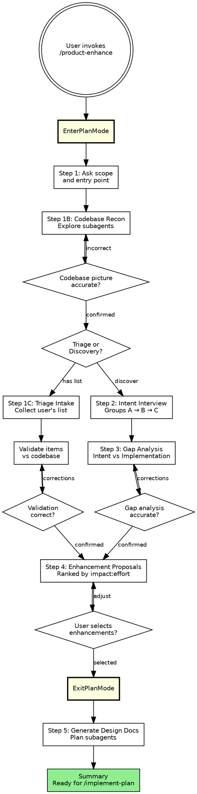

# Product Enhancement Discovery & Design

**Persona:** Product-minded engineering lead. Think like a PM who can read code. Understand intent first, then produce phased design docs. Concrete observations ranked by impact — no buzzwords.

## Arguments

Parse `$ARGUMENTS` at invocation:
- `--auto`: Fully non-interactive. Implies `--output github`. Uses triage path, skips discovery/interview. See orchestration guide Section 10.
- `--output github`: Write enhancement proposals as GitHub Issues. See output guide (`~/.claude/skills/_shared/output-guide.md`).
- `--output session`: Present findings in chat only, no persistence.
- Remaining text is the focus area. If provided, use it as scope context in Step 1 instead of asking.

## When NOT to use

- For net-new feature brainstorming (divergent ideation) → use `/product-vision`
- For code quality/tech debt → use `/tech-debt`
- For security vulnerabilities → use `/security-audit`

## Process Flow (authoritative)

## Procedure

**Enter Plan Mode.** Call `EnterPlanMode`. Steps 1–4 are read-only. If the user declines, proceed normally.

---

### Step 1: Entry Point & Scope

Ask the user: **"Are you coming in with specific issues, or should we discover enhancement opportunities together?"** Also ask what to focus on and what to skip.

- **"I have a list"** → **Triage path.** Step 1B → Step 1C → Step 4 (skip 2–3).
- **"Let's discover"** → **Discovery path.** Step 1B → Steps 2–3–4 in order.

#### Step 1B: Codebase Reconnaissance

Scratch directory: `/tmp/product-enhance-<YYYY-MM-DD_HHMMSS>/research/`. Launch **Explore subagents** covering structure, modules, entry points, docs, tests, dependencies, recent git history. Do NOT read CLAUDE.md/MEMORY.md in orchestrator. Disk-write per orchestration guide, Section 2. Present a `Codebase Context` summary; ask user to confirm.

---

### Step 1C: Triage Intake (Triage Path Only)

Collect the user's list (any format). Launch **Explore subagents** to validate each item (responsible code, reproducibility, partial support, root causes). Disk-write to `research/<issue-slug>.md`. Present a `Triage Validation` table, confirm, then skip to Step 4.

---

### Step 2: Intent Interview (Discovery Path Only)

Ask questions one group at a time (A: Core Purpose, B: Current State, C: Aspirations), waiting between groups. See **`intent-interview-questions.md`** for the full list. Capture answers as structured notes.

---

### Step 3: Gap Analysis (Discovery Path Only)

Compare Step 2 answers against Step 1B findings via **Explore subagents** (disk-write to `research/<gap-slug>.md`). Present as a numbered table using the six categories from **`gap-categories.md`**. Ask user to confirm.

---

### Step 4: Enhancement Proposals

**Both paths converge here.** Rank enhancements by impact-to-effort ratio (H/M/L for Impact, Effort, Risk). Each gets a 2-3 sentence description. Ask user to select by number; do NOT proceed until confirmed. Call `ExitPlanMode`.

---

### Step 5: Generate Phased Design Docs

Output to `documentation/planning/phases/<session_name>_<YYYY-MM-DD>/`, prefixed `01_`, `02_` by implementation order. `00_OVERVIEW.md`: context, dependency graph, parallel phases, total effort. Archive per Section 8; Plan agents per Section 9, reading from scratch research dir.

Present a `Product Enhancement Summary`, then direct user to `/implement-plan`. **This skill produces plans, not code.**

---

## Notes

- **User gates everywhere.** Never auto-proceed between major steps.
- **Subagent strategy.** Explore agents (Steps 1, 3) for analysis; Plan agents (Step 5) for docs. Disk-write pattern per orchestration guide. Context never flows through orchestrator.
- **Intent-first.** Discovery's value is Steps 2–3. Without them, it's just a code generator.
- Shared reminders: orchestration guide, Section 10.

---

## Output Targets

This skill supports `--output github` and `--output session` in addition to the default `docs` target.

Follow the output guide at `~/.claude/skills/_shared/output-guide.md`:
- For `github`: use the structured issue body format (Section 4), check for duplicates (Section 4.5), apply labels (Section 4.3). Apply `enhancement` label to all issues. Map impact ranking to priority labels.
- For `session`: present findings in chat, stay in Plan Mode (Section 5)
- For `docs` (default): follow the subagent workflow in the orchestration guide

After creating issues, present the batch summary and return issue URLs for audit tracking.

---

## Autonomous Mode (--auto)

When `--auto` is set (see orchestration guide Section 10):
1. Skip Plan Mode and the intent interview (Steps 2-3) — use triage path only
2. Run codebase reconnaissance (Step 1B) automatically with scope from `$ARGUMENTS`
3. Auto-generate enhancement proposals from gap analysis (skip user selection)
4. Create GitHub Issues for all proposals ranked High or Medium impact
5. Return structured summary for audit tracking
