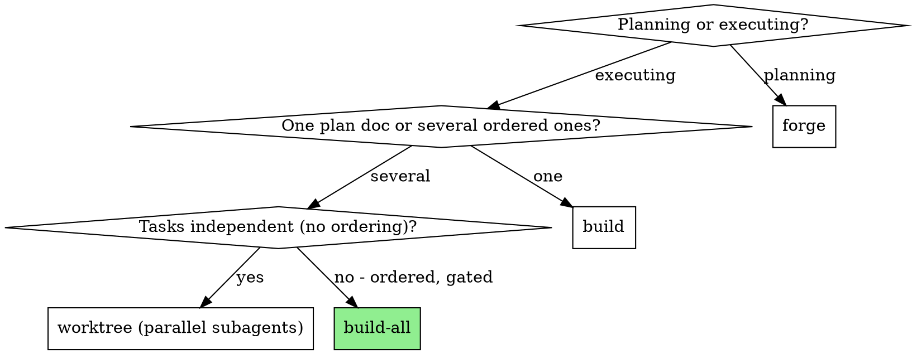
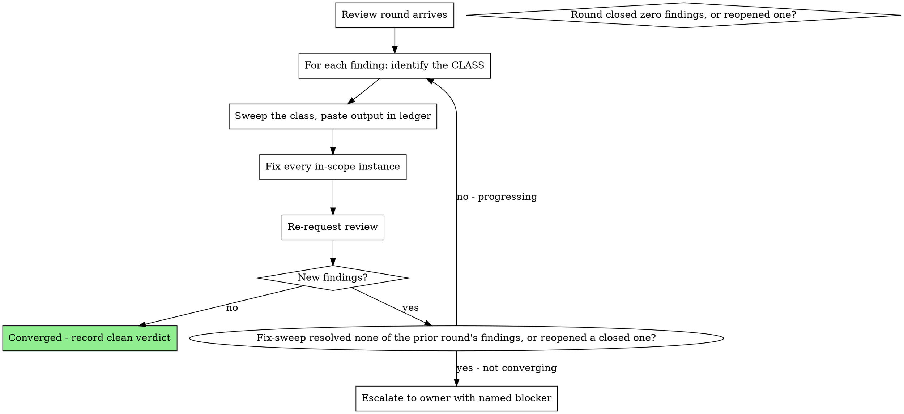

# Build All

Drive an epic's worth of phase docs as one governed run: ordered phases, each executed and shipped through the existing single-phase skills, with sprint-level state — invariants, merge topology, review convergence, deploy reachability — owned here, because no single-phase skill can see it.

**Core principle:** a sprint is not N independent phases. Everything this skill adds is cross-phase state; everything per-phase is delegated.

This skill **composes** `/claudna:build`, `/claudna:worktree`, the native `/simplify` command, `/claudna:verify-completion`, and `/claudna:ship`. It replaces none of them. Every requirement here is derived from a real nine-doc, 8-PR, two-repo, five-review-round epic that succeeded on a hand-written driver prompt and failed in six specific, paid-for ways; this skill exists so those six are owned by process rather than re-discovered.

## When to Use

**Not for:** a single plan doc (`/claudna:build`), independent parallelizable tasks (`/claudna:worktree` orchestrating parallel subagents), or planning the epic in the first place (`/claudna:forge`).

## Inputs — refuse to start without all three

1. **The phase docs** — a directory of plan docs, or a `forge` epic with sub-issues.
2. **A declared execution order with stated rationale.** "P6 first because behavior changes mid-epic corrupt the measurement" is a rationale; a bare ordering is not. If the docs don't state one, extract it from the epic's risk table or ask the owner. The order is load-bearing; treat reordering as a scope change, not a convenience.
3. **The goal condition** — the checkable statement that ends the sprint. If none exists, write one with the owner before phase 1.

## The Sprint Ledger

One markdown run log, created before phase 1, updated after every phase and every review round. Location: wherever the epic's docs live (e.g. `documentation/planning/<epic>/RUN_LOG.md`), with frontmatter linking the epic issue.

It carries, in order:

1. **Kickoff gates** — every pre-flight gate from the epic and its disposition. A gate is *passed*, *waived by the owner in writing*, or *blocking*. A waiver records who granted it and the residual risk in plain words. **The runner never waives a gate.**
2. **The invariant registry** (below).
3. **The merge topology plan** (below).
4. **Phase results table** — phase / doc / issue / status / PR / CI, one row each.
5. **Per-phase entries** — verification output pasted, scope exclusions stated, premise findings recorded rather than papered over.
6. **Review-round entries** — per round: which findings, the class sweep for each, what closed.
7. **Owner-decision queue** — merges, deploys, deferred forks, blocked items. The sprint's last act is making this list complete.

The ledger is what makes the goal condition checkable and the sprint auditable. No ledger, no sprint — a chain of PRs with no run log is exactly the improvised state this skill exists to end.

## Invariant registry — declare once, re-check every phase

Before phase 1, extract from the epic every property that must hold **across** phases. Examples of the shape:

- two copies of a file/bundle in two repos stay byte-identical at every merge point
- a baseline is frozen before any phase changes the behavior being measured
- a wire id / public contract stays byte-unchanged
- no second <thing> is declared until phase X lands

For each: the invariant, the check command, and what to do on breakage. **After every phase merges, run every check and paste the output into the ledger.** A broken invariant stops the sprint — fix it or escalate; never proceed past it.

Why this is non-negotiable: the origin epic had exactly one such invariant (a skill bundle shipped byte-identical to two repos). It was maintained by hand, it broke repeatedly, and it was caught by hand each time — and the two copies turned out to have *already* drifted on main before the sprint began, with the defective copy live. Hand-maintained invariants break; that is what registries are for.

## Merge topology — plan it before the first branch

Declare, up front, per repo: merge method (squash vs merge), which phases pair across repos, and which branches depend on which.

**The rule that was paid for: squash-merge + stacked branch = guaranteed conflict.** Squash rewrites the parent's commits into one, so the child branch's history no longer matches main and its diff re-includes the parent's. This is structural, not bad luck. Either:

- **Avoid stacking** — wait for the parent PR to merge, then branch off fresh main; or
- **Plan the rebase** — stack, and schedule `git rebase --onto origin/main <parent-branch>` for the moment the parent squash-merges, then verify `git diff origin/main..HEAD --stat` shows only the child's intended scope before push.

Cross-repo pairs (hub PR + dbt twin) get an explicit merge order in the ledger, and neither merges until both are green and reviewed.

## Per-phase protocol

Each phase, in order — the composition is the point; do not inline what a skill already owns:

1. **Isolate** — `/claudna:worktree`. One phase, one workspace, clean test baseline.
2. **Implement** — `/claudna:build` on that phase's doc (or decompose into independent in-session subagent tasks when the phase itself splits cleanly and you're staying in-session).
3. **Test per the doc** — run the phase doc's own test plan, not a generic suite pass. A checklist item the session cannot reach (needs a credential, a deploy, a week-long window) is recorded as BLOCKED in the ledger with the smallest unblocking action — never silently skipped, never quietly narrowed.
4. **Simplify** — run the native `/simplify` command before the push. This is not polish. In the origin epic, both code PRs shipped green with pasted verification and still carried defects their own tests were structured to miss — one had two tests passing for the wrong reason. Green CI plus honest evidence was not sufficient; a second independent read was. Skipping this step is how a compiling, green, wrong change ships.
5. **Verify** — `/claudna:verify-completion`. Evidence before claims, fresh output pasted into the ledger.
6. **Scope check** — the PR file list contains only the phase's intended scope (`git diff origin/main..HEAD --stat`). Unrelated files are stale-base cargo; drop them before push.
7. **Deploy reachability** (below) — answer it before declaring the phase done.
8. **Ship** — `/claudna:ship`. PR body names deliberate omissions and scope exclusions.
9. **Ledger** — write the phase entry; re-run the invariant registry.

**Composition boundary, stated so two agents don't diverge on it:** `/claudna:build` is itself a pipeline — it carries its own verify, simplify, and PR-creation steps. When step 2 runs it in full, those satisfy steps 3-5 and 8: do **not** re-run them or open a second PR; capture the evidence it produced into the ledger. Steps 6, 7, and 9 — scope check against the sprint's topology, deploy reachability, and the ledger/invariant pass — are always the sprint's own; no composed skill performs them. Whatever the engine, every phase ends with all nine accounted for, each either performed here or satisfied by the composed run, and the ledger says which.

**Hard stops:** work the epic marks owner-gated (auth surfaces, security-adjacent config, ratification-gated forks) stops the phase and lands in the owner-decision queue. Proceeding "because the lean was documented" is the runner waiving a gate — see Ledger rule 1.

## Deploy reachability — merged is not live

Per phase, before its ledger entry: **"what makes this change live, and is that automated?"**

- CI deploys on merge → merged = live; no deploy caveat needed in the phase entry.
- Manual deploy (a sandbox substrate, an operator command, an uninstalled workflow) → the phase's status is **"merged, NOT live"** until the deploy is confirmed. Record the exact operator command in the ledger and the owner-decision queue. Never report the phase as shipped/verified-live.

The origin epic shipped two phases whose code was completely inert on merge because the deploy was manual — and the CI workflow that would have fixed it had existed, uninstalled, for four months. If you find that shape (deploy automation written but not installed), file it — it outranks most of the sprint.

## Review convergence — the loop, its stopping rule, and the class sweep

A sprint's PRs get independent review (per repo convention). Reviews arrive in rounds; convergence is a governed loop, not an improvisation:

**Stopping rule:** the loop ends on a clean verdict (a round with no new findings) or a named blocker escalated to the owner. A round that closes nothing, or reopens a closed finding, is not progressing — escalate rather than loop. Each round's ledger entry names which findings closed, so progress is checkable rather than felt.

### The class sweep — per finding, no exceptions

A reviewer cites an *instance*. You fix the *class*:

1. **Name the class.** For code: the pattern (`grep`-able — the same call, idiom, or template the instance came from). For prose/claims: the claim itself, everywhere it was restated — a false sentence corrected in one doc and left standing in three others is three live defects.
2. **Sweep the whole scope** — the full repo set the sprint touches, *including the other sprint branches not yet merged*. Not the cited file. Not the cited directory.
3. **Show the sweep output** — in the ledger and the PR reply. "Swept: `grep -rn <pattern>` → N hits, M fixed, K legitimate (listed)" is evidence; "fixed" is not.
4. **Fix in-scope siblings now.** A follow-up issue is for siblings genuinely outside the sprint's scope — it is not a deferral mechanism for the ones in it.

Origin evidence: the same grep pattern produced three separate review findings (wrong separator, then wrong directory, then wrong shell quoting) and the same false claim was corrected three separate times — five review rounds, largely because each fix was instance-shaped. Baseline testing of this skill reproduced the failure: agents sweep the cited file's directory and offer "I'll file a follow-up" for the rest.

## Measure before asserting

Any claim about a population — "no legitimate counterexample", "all X do Y", "this is never used", "every occurrence is a bug" — requires counting the population first, with the count and the command in the ledger or PR body.

Origin evidence: a rule justified by "no legitimate counterexample" had 35 counterexamples, then 61 once measured against the right population. Baseline testing reproduced it exactly: asked to write a PR body for a lint rule, an agent shipped "there's no legitimate reason to reach for sleep()" and "every occurrence we've hit has been a masked race" — without counting occurrences, and explicitly deferring the count to a follow-up PR. The claim shape is seductive precisely when the sprint is behind schedule. The fix is mechanical: name the population, run the count, show the number, *then* write the sentence the number supports.

## Ending the sprint

1. Every phase row in the ledger is a terminal state: DONE (with evidence), BLOCKED (with the smallest unblocking action), or owner-gated (queued).
2. The invariant registry ran after the final phase; all green or escalated.
3. The goal condition is answered, from ledger contents, honestly — including "not met, because X".
4. The owner-decision queue is complete: pending merges with their required order, manual deploys with their commands, deferred forks with their triggers.

A sprint that ends with "all PRs open" has ended correctly if the repo's convention is human-gated merges — the queue is the deliverable.

## Red flags — stop and re-read the relevant section

| Rationalization | Reality |
|---|---|
| "I fixed what the reviewer cited" | The reviewer cited an instance. Sweep the class, show the output. |
| "I'll file a follow-up for the siblings" | In-sprint siblings are in scope *now*. Follow-ups are for out-of-scope only. |
| "I swept the directory" | The class scope is every repo and branch the sprint touches. |
| "Green CI + pasted evidence = done" | The origin epic shipped green, evidenced, wrong — twice. Run `simplify`; get the independent read. |
| "No legitimate counterexample exists" | 35, then 61. Count the population first. |
| "Merged, so it's shipped" | Merged is not live. Answer the deploy-reachability question. |
| "The parent will have merged by then" | Squash + stacked = structural conflict. Plan the rebase or don't stack. |
| "The gate's lean was documented, so proceed" | Documented ≠ ratified. The runner never waives a gate; queue it. |
| "The invariant held last phase" | Re-check every phase. Hand-maintained invariants are how the origin epic broke. |
| "This checklist item can't run here, skip it" | BLOCKED with the smallest unblocking action, in the ledger. Never silent. |
| "One more review round will do it" | If the round closed nothing, you are not converging. Escalate with a named blocker. |

## Integration

- **Upstream:** `/claudna:forge` produces the epic and phase docs this skill drives; `/claudna:ironclad` hardens them.
- **Per phase:** `/claudna:worktree` (isolate) · `/claudna:build` (or in-session subagent decomposition for phases that split cleanly) · the native `/simplify` command · `/claudna:verify-completion` · `/claudna:ship` (ship).
- **Merge gates:** the repo's own review/merge conventions apply unchanged — this skill never merges anything a repo's policy reserves for humans.
