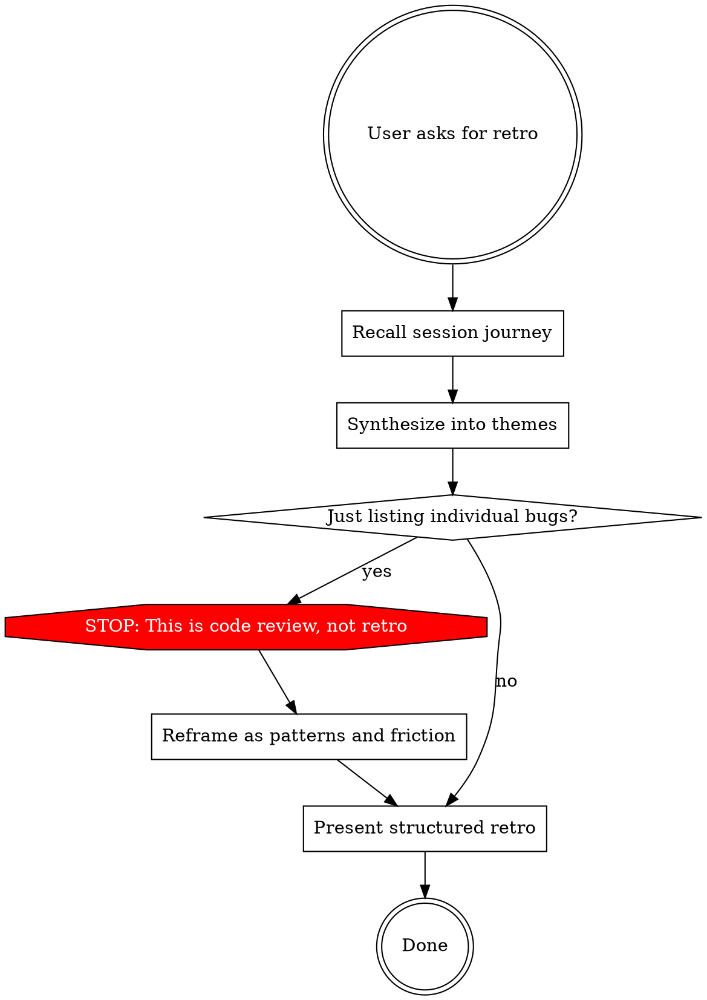

# Development Retro

Surface observations from the implementation journey — things you noticed *while doing the work* that fell outside the PR's scope.

**This is NOT a code review.** Code review finds bugs in the diff. A retro surfaces insights from the journey: patterns you noticed across files, friction you experienced, inconsistencies you worked around, areas you suspect have similar issues but didn't verify.

## Arguments

Parse `$ARGUMENTS` at invocation:
- `--output github`: Write findings and plans as GitHub Issues. See output guide (`skills/_shared/output-guide.md`).
- `--output session`: Present findings in chat only, no persistence.

Default (no flag): Present retro in chat (session-only by default).

## When to Use

- After merging a PR
- At the end of a development session
- When the user asks "anything else you'd recommend?"
- When the user asks you to reflect on the work

## Process



## What to Reflect On

Think through these lenses. Skip any that genuinely have nothing to report — but push yourself before concluding "nothing."

### 1. Systemic Patterns

Don't list individual issues — synthesize them into themes. Individual issues are symptoms; patterns are the diagnosis.

- "I noticed three different error handling approaches across the routes I read" > "admin routes don't handle errors"
- "Every file I touched had a different way of fetching user data" > "Profile.tsx doesn't use the useUser hook"
- "The middleware application is inconsistent — some routes have rate limiting, some don't" > "admin routes lack rate limiting"

**Ask yourself:** What do the individual things I noticed have in common? What's the underlying pattern?

### 2. Breadcrumb Trails

Flag areas you *suspect* have similar issues based on what you observed, but didn't verify. These are leads, not findings.

- "If Profile.tsx bypasses the useUser hook, other pages might too — worth auditing"
- "I found one middleware gap; the middleware application pattern should be reviewed systematically"
- "The stale TODO I found was 8 months old — there may be others"

**Frame as:** "Based on [what I saw], I suspect [where to look] may have [similar issue]. Worth investigating."

### 3. Development Friction

What made *your* work harder, slower, or more confusing? This reveals developer experience problems that accumulate across the team.

- Untyped APIs that forced manual type assertions
- God components you had to work around
- Missing abstractions that caused duplication
- Confusing naming or file organization
- Undocumented behavior you had to reverse-engineer

**Frame as:** "While building X, I had to [workaround] because [root cause]. This would slow down anyone doing similar work."

### 4. Positive Patterns

What worked well? What conventions should be preserved, extended, or documented?

- "The hook pattern in useUser.ts is solid — the issue is that not all pages use it"
- "The test structure in the user routes is well-organized and easy to extend"
- "The CSS module approach in forms is clean — worth standardizing on"

**Why this matters:** Retros that only surface problems create a skewed picture. Calling out what works prevents good patterns from being accidentally removed in future refactors.

### 5. Concrete Next Steps

For each theme, provide:
- **Impact:** What's the risk or cost of not addressing this?
- **Effort:** Quick fix, focused task, or larger initiative?
- **Suggested action:** File an issue, create a follow-up PR, add to tech debt backlog, or just note for awareness

## Output Format

Structure your retro as:

```
## Development Retro: [Brief description of the work completed]

### Systemic Patterns
[Themes, not individual bugs]

### Breadcrumb Trails
[Areas to investigate, with reasoning]

### Friction Points
[What slowed you down and why]

### What Worked Well
[Patterns worth preserving]

### Recommended Next Steps
[Prioritized by impact/effort, with suggested actions]
```

Omit any section that genuinely has nothing — but challenge yourself before skipping. An empty "What Worked Well" usually means you weren't looking.

## Red Flags — You're Doing Code Review, Not Retro

- Listing individual bugs without connecting them to a pattern
- Every observation is about a single file in isolation
- Nothing references your experience of doing the work
- No breadcrumb trails — you're only reporting confirmed issues
- No positive observations — you're only looking for problems
- Observations could have been made by scanning the code without doing the PR work

**The test:** Could someone who *didn't* do this work have written your retro just by reading the codebase? If yes, it's code review, not a retro. Reframe.

---

## Output Targets

This skill supports `--output github` and `--output session` in addition to the default `session` target.

Follow the output guide at `skills/_shared/output-guide.md`:
- For `github`: use the structured issue body format (Section 4), check for duplicates (Section 4.5), apply labels (Section 4.3). Create one issue per systemic pattern or breadcrumb trail that warrants follow-up work. Label with `auto-audit` and `tech-debt` or `enhancement` as appropriate.
- For `session` (default): present findings in chat, stay in Plan Mode (Section 5)
- For `docs`: write the retro to `documentation/planning/retros/<session_name>_<YYYY-MM-DD>/`

---

## Common Rationalizations

| Excuse | Reality |
|--------|---------|
| "Nothing else to report" | You read multiple files and made changes. You noticed things. Surface them. |
| "These are too minor to mention" | Minor observations often reveal systemic patterns. Mention the pattern. |
| "That's outside the scope" | The entire point of a retro is to surface things outside scope. |
| "I don't want to overwhelm them" | Structure and prioritize. Don't omit. |
| "I'll just list the bugs I found" | Bugs are for code review. Retro is for patterns, friction, and insights. |
| "The positive stuff is obvious" | If it's obvious, it takes one sentence. Include it. |
