# Implement Plan

Execute a design or development plan against the codebase. Challenge first, refine through dialogue, then build — updating the plan as the single source of truth throughout. Works with any structured development document (downstream of `/claudna:tech-debt`, `/claudna:product-enhance`, or standalone) or a GitHub Issue created by `--output github`.

## Arguments

Parse the invocation arguments:
- `--source github <number>`: Read a specific GitHub Issue as the implementation plan.
- `--source github` (no number): Browse all open issues via paginated picker — select one or more to implement.
- Remaining text (or no flag): treated as a file path or session directory.
- No arguments at all: scan for plan directories and present a picker.
- See source guide (`skills/_shared/source-guide.md`) for details on both GitHub modes.

## Engineering Philosophy

Read `engineering-principles.md` in this skill directory. Every decision during review and implementation is filtered through those principles (first principles, simple design, modularity, clean implementation, separation of concerns). Code that doesn't meet them doesn't merge.

## Command Execution Rules

Shell operators (`&&`, `||`, `;`, `|`) break `allowed-tools` matching. Never chain or pipe — make separate parallel Bash calls. Use venv python directly (`./venv/bin/python -m pytest`). Use absolute paths instead of `cd`.

## Process Flow

> **This flowchart is the authoritative process definition. Prose below provides detail for each step.**

```dot
digraph implement_plan {
    rankdir=TB;
    node [fontname="Helvetica" fontsize=10];
    edge [fontname="Helvetica" fontsize=9];

    start [label="User invokes\n/implement-plan" shape=doublecircle];

    parse [label="Parse arguments" shape=box];
    has_path [label="File path\nprovided?" shape=diamond];
    has_number [label="--source github\nwith number?" shape=diamond];
    has_source_gh [label="--source github\nno number?" shape=diamond];
    has_no_args [label="No arguments" shape=box];

    direct_file [label="Path A: Read file\nor browse directory" shape=box];
    direct_issue [label="Path B: Fetch issue\nby number" shape=box];
    browse_issues [label="Path D: Browse issues\npaginated picker" shape=box];
    browse_dirs [label="Path C: Scan directories\ntwo-level picker" shape=box];

    queue [label="Execution queue\n(1+ items)" shape=box];
    next_item [label="Dequeue next item" shape=box];

    step2 [label="Step 2: Codebase Comparison\nExplore subagents" shape=box];
    blockers [label="Blockers?" shape=diamond];
    report_blockers [label="STOP\nReport blockers" shape=doublecircle];

    step3 [label="Step 3: Challenge Round\nAdaptive AskUserQuestion" shape=box];
    update_plan [label="Update plan" shape=box];
    more_challenges [label="More\nchallenges?" shape=diamond];
    ready [label="Ready to\nbuild?" shape=diamond];

    step4 [label="Step 4: Mark In Progress" shape=box];
    step5_branch [label="Step 5: Create branch\nimplement/<slug>" shape=box];
    implement [label="Implement next\nplan step" shape=box];
    feels_wrong [label="Feels\nwrong?" shape=diamond];
    discuss [label="STOP\nDiscuss with user" shape=box];
    commit [label="Commit chunk" shape=box];
    more_steps [label="More\nsteps?" shape=diamond];

    step6a [label="Step 6A: Deliverable Audit" shape=box];
    audit_pass [label="All\ncomplete?" shape=diamond];
    fix_deliverable [label="Fix incomplete\ndeliverable" shape=box];

    step6b [label="Step 6B: Verification\nChecklist" shape=box];
    verify_pass [label="All\npass?" shape=diamond];
    fix_check [label="Fix failing\ncheck" shape=box];

    step7 [label="Step 7: Create PR\nStatus → COMPLETE" shape=box];
    user_gate [label="Merge or\nstop?" shape=diamond];

    step8 [label="Step 8: Merge & Cleanup" shape=box];
    more_queued [label="More in\nqueue?" shape=diamond];
    continue_gate [label="Continue to\nnext?" shape=diamond];

    summary [label="Step 9: Summary" shape=box style=filled fillcolor=lightgreen];

    start -> parse;
    parse -> has_path;
    has_path -> direct_file [label="yes"];
    has_path -> has_number [label="no"];
    has_number -> direct_issue [label="yes"];
    has_number -> has_source_gh [label="no"];
    has_source_gh -> browse_issues [label="yes"];
    has_source_gh -> has_no_args [label="no"];
    has_no_args -> browse_dirs;

    direct_file -> queue;
    direct_issue -> queue;
    browse_issues -> queue;
    browse_dirs -> queue;

    queue -> next_item;
    next_item -> step2;
    step2 -> blockers;
    blockers -> report_blockers [label="yes"];
    blockers -> step3 [label="no"];
    step3 -> update_plan;
    update_plan -> more_challenges;
    more_challenges -> step3 [label="yes"];
    more_challenges -> ready [label="no"];
    ready -> step4 [label="ready"];
    ready -> step3 [label="revise"];
    step4 -> step5_branch;
    step5_branch -> implement;
    implement -> feels_wrong;
    feels_wrong -> discuss [label="yes"];
    feels_wrong -> commit [label="no"];
    discuss -> implement;
    commit -> more_steps;
    more_steps -> implement [label="yes"];
    more_steps -> step6a [label="no"];
    step6a -> audit_pass;
    audit_pass -> step6b [label="yes"];
    audit_pass -> fix_deliverable [label="no"];
    fix_deliverable -> step6a;
    step6b -> verify_pass;
    verify_pass -> step7 [label="yes"];
    verify_pass -> fix_check [label="no"];
    fix_check -> step6b;
    step7 -> user_gate;
    user_gate -> step8 [label="merge"];
    user_gate -> summary [label="stop"];
    step8 -> more_queued;
    more_queued -> continue_gate [label="yes"];
    more_queued -> summary [label="no"];
    continue_gate -> next_item [label="yes"];
    continue_gate -> summary [label="stop"];
}
```



## Procedure

Follow these steps exactly in order.

---

### Step 1: Receive the Plan

Route based on arguments. Four input paths, all leading to an execution queue.

**Path A — Direct file or directory:**
User passes a path. If it's a `.md` file, read it, confirm with user, add to queue (single item). If it's a directory, read `00_*.md` (overview), then present the **Level 2 plan picker** (multi-select, paginated — same as Path C step 5) to select which plans to implement. Queue selected plans.

**Path B — Direct issue (`--source github <number>`):**
Fetch the issue via `gh issue view <number> --json number,title,body,labels,state,url`. Validate the detail level per the source guide (Section 4). If findings-only, offer to expand. Add to queue (single item).

**Path C — Directory browser (no arguments):**

1. Scan `documentation/planning/` for subdirectories containing `0N_*.md` files
2. If none found: fall back to asking **"Which document should I implement?"** and accept a file path
3. **Level 1 — Directory picker** (single-select, paginated):
   - Use AskUserQuestion to present up to 3 directories + "More..." as 4th option
   - Each option label: directory name. Each description: N plans, M complete.
   - Selecting "More..." presents the next page of directories
4. Read `00_*.md` (overview) from chosen directory
5. **Level 2 — Plan picker** (multi-select, paginated):
   - If only 1 plan exists: auto-select it, confirm with user, skip picker
   - Print a full summary table in chat: plan number, title, status, severity/effort
   - Use AskUserQuestion with `multiSelect: true` — up to 3 plans + "Done selecting" as 4th
   - Accumulate selections across pages
   - After last page, confirm: **"You selected N plans. Proceed?"**
6. Queue all selected plans

**Path D — Issue browser (`--source github`, no number):**

1. Fetch all open issues: `gh issue list --state open --limit 50 --json number,title,labels`
2. If no open issues: tell user **"No open issues found in this repo."** and stop
3. Print a full summary table in chat: issue number, title, labels, priority
4. **Issue picker** (multi-select, paginated):
   - If only 1 issue: auto-select it, confirm with user, skip picker
   - Use AskUserQuestion with `multiSelect: true` — up to 3 issues + "Done selecting" as 4th
   - Accumulate selections across pages
   - After last page, confirm: **"You selected N issues. Proceed?"**
5. Fetch full body for each via `gh issue view <number>`
6. Validate detail level for each (source guide Section 4). Offer to expand findings-only issues.
7. Queue all selected issues

#### Pagination Rules

AskUserQuestion supports max 4 options. Pagination works differently for single-select and multi-select:

**Single-select** (Level 1 directory picker):
- Show items 1-3 + "More..." as 4th option
- Selecting "More..." triggers another AskUserQuestion with the next batch
- Last page shows remaining items (2-4, no "More...")
- User can always type via "Other" to specify by name

**Multi-select** (Level 2 plan/issue picker):
- Print the **full list** as a numbered table in chat first — the user can see everything
- Then present paginated AskUserQuestion pages with `multiSelect: true`:
  - Each page shows 3 items + "Done selecting" as 4th option
  - User checks items on this page, submits → selections are accumulated
  - Next page auto-appears with the next batch of items
  - Selecting "Done selecting" (or reaching the last page) stops pagination
- After pagination ends, confirm: **"You selected: [list]. Proceed?"**
- User can always type via "Other" to add items by name or number

#### Execution Queue

When multiple plans or issues are selected, they form an ordered queue:

```
Session queue: 3 items
  1. [next]    01_domain-validation.md — CRITICAL
  2. [queued]  02_search-extraction.md — HIGH
  3. [queued]  03_error-handling.md — MEDIUM
```

Each item goes through the full implementation flow (Steps 2-8) sequentially. After each item's PR is merged (Step 8), present the queue status and use AskUserQuestion:

- "Continue to next: [next item name]"
- "Skip to a different item" (if 3+ items remain)
- "Stop here"

**Do NOT auto-start the next item.** The user should run `/compact` between items to manage context. Present the exact command: `/compact` then `/claudna:implement-plan <path-or-source>` for the next queued item.

For direct paths (A and B): the queue contains a single item. Steps 2-9 execute once with no queue logic.

---

### Step 2: Codebase Comparison

Use Explore subagents (Task tool) to verify: file paths, function names, before/after examples, codebase patterns, dependency chain. Present a `Plan vs. Codebase` table. Stop on blockers; continue with stale references noted.

---

### Step 3: Challenge Round

Read `challenge-round-questions.md` for the question matrix and `red-flags-and-rationalizations.md` to guard against rubber-stamping.

**Adaptive one-at-a-time flow using AskUserQuestion:**

1. Analyze the plan against the codebase (Explore subagents — same as before)
2. Generate the first challenge question based on the question matrix categories
3. Present via AskUserQuestion with 2-4 **contextual options** drawn from the codebase — not generic "accept/reject" but concrete alternatives (e.g., "Extend existing Pydantic model" vs "Add new validation layer" vs "Keep both — defense in depth")
4. Process the user's answer. Update the plan document (or issue body) immediately if the answer changes the approach.
5. Generate the next challenge, informed by the previous answer
6. Repeat until:
   - All relevant categories from the question matrix have been probed
   - No more substantive challenges remain
   - User selects "Skip remaining challenges" (always include as an option)
7. Final gate — AskUserQuestion: **"Ready to build?"** with options:
   - "Ready to build" (proceed to Step 4)
   - "I have more concerns" (loop back to Step 3)
   - "Abort — not implementing this"

**The question matrix still guides what to challenge** (architecture, testing, dependencies, error handling, etc.). The delivery mechanism changes — each question gets its own focused AskUserQuestion instead of a batch of 3-5 in chat.

---

### Step 4: Mark In Progress

**For `--source docs`:** Update the plan document status to `IN PROGRESS` with a `Started: YYYY-MM-DD` timestamp. Update the overview doc if applicable.

**For `--source github`:** Add `in-progress` label to the issue via `gh issue edit <number> --add-label "in-progress"`.

---

<HARD-GATE>
Do NOT write any code, create any branch, or make any changes until Step 3 (Challenge Round) is complete and the user has confirmed "Ready to build."
</HARD-GATE>

### Step 5: Branch & Implement

Create branch `implement/<slug>`. Implement incrementally — commit per logical chunk with messages referencing plan steps. If a step feels wrong, **stop and discuss**.

Apply `engineering-principles.md` ("Applying During Implementation" checklist). Run tests continuously. Update documentation as specified.

---

### Step 6: Verify

**A. Deliverable Audit** — Every deliverable in the phase doc must be marked `COMPLETE` or skipped with justification. Present audit table. Fix gaps.

**B. Verification Checklist** — Run the plan's checklist: tests, lint, types, docs, manual checks. Present results. Fix failures.

---

### Step 7: PR & Status Update

Create PR (title from plan header/issue title, body with summary + verification results).

**For `--source docs`:** Update plan document to `COMPLETE` with timestamp and PR reference.

**For `--source github`:** Include `Closes #<number>` in the PR body. Remove `in-progress` label via `gh issue edit <number> --remove-label "in-progress"`.

Tell the user the PR is ready.

---

### Step 8: Merge, Cleanup & Handoff

Tell the user: **"Say `merge` to merge and wrap up, or `stop` to end here."**

On `merge`: merge PR, switch to main and pull (separate Bash calls).

**For `--source docs`:** Archive plan doc via `git mv`, update cross-references.

**For `--source github`:** The issue auto-closes when the PR merges (via `Closes #<number>`). No archival needed.

**If more items remain in the queue:** Present the queue status and use AskUserQuestion to offer continuing to the next item, skipping, or stopping. Provide the exact commands: `/compact` then `/claudna:implement-plan <path-or-source>` for the next item.

Suggest worktree parallelism for independent phases. **Do NOT auto-start** — the user must run `/compact` between items.

---

### Step 9: Summary

Present an Implementation Summary: session name, phases completed/remaining with PR numbers, challenges resolved, updates made, archive location. If items remain in the queue, list them with their status.

---

## Notes

- The plan is the **single source of truth** — write all changes back to it (file on disk for `--source docs`, issue body for `--source github`).
- Step 3 is not optional. See `red-flags-and-rationalizations.md`.
- Stop and discuss when something feels wrong.
- One PR per plan. Tests are not optional. Deliverable audit before PR.
- One gate between queue items: merge, archive/close, `/compact`, then next item.
- Suggest worktree parallelism for independent phases.
